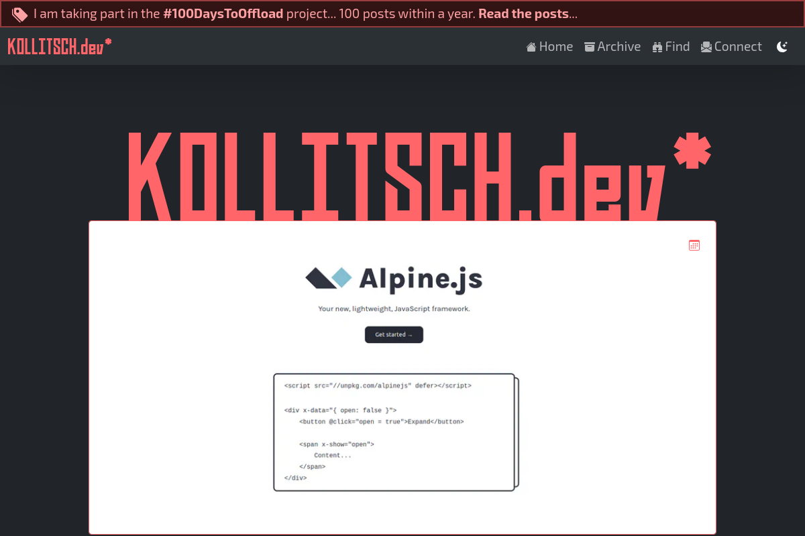

<!--lint disable no-multiple-toplevel-headings -->

This project is the website setup and content for [kollitsch.dev](https://kollitsch.dev/).



# Site structure


- [kollitsch.dev](https://github.com/davidsneighbour/kollitsch.dev) - this repository, website configuration and content
- [hugo-theme](https://github.com/davidsneighbour/hugo-theme) - the theme used for the website
- [hugo-modules](https://github.com/davidsneighbour/hugo-modules) - Hugo modules that add reusable components to any Hugo website.
- [configurations](https://github.com/davidsneighbour/configurations) - Configuration files for various tools used in this project.

This site's infrastructure is as follows:

<!--lint ignore-->

| Domain Registration | DNS and CDN | Hosting | SSG Build |
| :---: | :---: | :---: | :---: |
| [Google](https://domains.google.com/) | [Cloudflare](https://cloudflare.com) | [Netlify](https://netlify.com) | [Hugo](https://gohugo.io) |

Feel free to [open an issue](https://github.com/davidsneighbour/kollitsch.dev/issues/new?assignees=davidsneighbour&labels=state%3Aunconfirmed&template=custom.md&title=) to ask questions, discover undocumented details, or suggest improvements. [Discussions](https://github.com/davidsneighbour/kollitsch.dev/discussions) are also open directly or via commenting on articles.

---

Codacy:    

---

<!-- markdownlint-disable MD010 MD007 -->
<!--lint ignore-->

- [Site structure](#site-structure)
- [General notes](#general-notes)
- [Setup](#setup)
  - [Prepare the development environment](#prepare-the-development-environment)
  - [Advanced setup steps](#advanced-setup-steps)
  - [Pre-Commit](#pre-commit)
  - [SSL/TLS setup](#ssltls-setup)
- [Development](#development)
  - [Dev Setup](#dev-setup)
  - [Release](#release)
  - [Deploy](#deploy)
  - [Theme](#theme)
    - [Paradigms](#paradigms)
  - [Netlify setup](#netlify-setup)
  - [Hooks (WIP)](#hooks-wip)
- [Content](#content)
  - [Archetypes](#archetypes)
  - [Front matter parameters](#front-matter-parameters)
    - [Layout options](#layout-options)
  - [Shortcodes](#shortcodes)
- [Code and Content Quality](#code-and-content-quality)
  - [Linting](#linting)
    - [On Save](#on-save)
      - [Vale (wording and grammar checks)](#vale-wording-and-grammar-checks)
        - [Updating Vale](#updating-vale)
      - [Markdownlint (markdown format checks)](#markdownlint-markdown-format-checks)
    - [On Commit](#on-commit)
- [Troubleshooting](#troubleshooting)
  - [Inkscape](#inkscape)
- [License](#license)

<!-- markdownlint-enable MD010 MD007 -->

---

# General notes

- The keywords MUST, MUST NOT, REQUIRED, SHOULD, SHOULD NOT, RECOMMENDED, MAY, and OPTIONAL in this document are to be interpreted as described in [RFC 2119](https://www.ietf.org/rfc/rfc2119.txt).
- I am working on Ubuntu, meaning all code samples in this document are working on Ubuntu and any comparable (Debian-based) Linux system. If you use another operating system, you are on your own. I assume most tools, scripts, and procedures should work on other systems with the appropriate changes because I mainly use open-source programs and scripts.

# Setup

Install this repository and all submodules via `git clone --recurse-submodules https://gitlab.com/davidsneighbour/kollitsch.dev.git`. If you have cloned the repository before reading this, run `git submodule update --init --recursive` to get the submodules up-to-date.

## Prepare the development environment

- **[Hugo](https://gohugo.io/)** ([Installation instructions](https://gohugo.io/getting-started/installing/))
- **[Node.js](https://nodejs.org/)** ([I recommend using NVM](https://github.com/nvm-sh/nvm) to install Node.js)
- **[Bash](https://www.gnu.org/software/bash/)** (available on any self-respecting operating system)
- **[Shellcheck](https://github.com/koalaman/shellcheck)** (`snap install -channel=edge shellcheck`)
- Running **`npm install`** will add all set-up requirements
- Copy `.env.sample` to **`.env`** and specify the values used by scripts and the build systems for various tasks. You **MUST NOT** commit the `.env` file to the repository for privacy and security reasons. Take notes of your configuration data somewhere safe, like in [Keybase](https://keybase.io) or a password manager.
- Setup signed tags with `npm config set sign-git-tag true`

## Advanced setup steps

- **GitHub Actions:** To enable the step to debug logging for the GitHub Workflows, you must set the following secret in the repository that contains the workflow: `ACTIONS_STEP_DEBUG` to `true`. You find the settings page by following `Settings > Secrets > Actions` from the repositories home page.

## Pre-Commit

Install and set up `pre-commit` to lint commits for quality and security. Python is required for this. Then run the following commands to set up `pre-commit` locally:

```bash
pip install pre-commit
pre-commit install
```

Other `pre-commit` commands are:
If you installed pre-commit and one of your commits won't "get through" due to some weird overzealous configuration, you can always commit manually via `git commit --no-verify`; use your brain on this one.

## SSL/TLS setup

Hugo introduced a new SSL feature in v0.113.0. The setup is still quite manual, but it's a start. To enable SSL/TLS, you need to do the following:

- install mkcert (see [mkcert](https://github.com/FiloSottile/mkcert))

  ```bash
  hugo server trust
  ```

# Development

## Dev Setup

Set `IP` and `PORT` for your local machine in `.env`. `IP` _MAY_ also be a hostname (without protocol).

```ini
IP=192.168.1.201
PORT=1313
```

This configures the Hugo server so you can access the site from other machines (and mobile devices) in your local network. Again: you _MUST NOT_ commit this file to any public code versioning system as it contains private information.

To start the development server, run `npm run server`, which runs the Hugo server with more or less paranoid settings (show translation issues, template issues, be verbose, debug, the more, the better). For example, running just `hugo server` will start Hugo on [localhost:1313](http://localhost:1313).

## Release

Sidenote: I use these scripts only if I want to create a new minor or major release of the website. All other "releases" are done when deploying the website (see [Deploy](#deploy)).

- Create patch release with `npm run release` or `npm run release:patch`
- Create minor release with `npm run release:minor`
- Create major release with `npm run release:major`

## Deploy

As noted, this repository is optimized for Netlify. To create a local copy of the website, run `npm run build` or `./bin/netlify/build`.

Running `npm run deploy` creates a new tag in the `main` branch and deploys the site on Netlify.

## Theme

The theme is part of this repository, mainly in the `layouts` folder.

### Paradigms

- Spacing (margin and padding) is applied from top to bottom.
- We use responsive design principles with mobile-first.
  No unnecessary `row`s inside of `row`s (container>row>col>row>col) if this isn't explicitly required. It isn't needed anyway.
- Do re-use and recycle styles.

## Netlify setup

```bash
npm install netlify-cli -g && netlify login
netlify --telemetry-disable // shouldn't that be the default?
netlify init
netlify build
```

If any errors come up while running this, then fix them.

## Hooks (WIP)

Hooks are listed in their order of appearance.

<!-- prettier-ignore-start -->
<!--lint ignore-->
| Hook  | File  | Runs | Depends on | Description  |
| --- | --- | --- | --- | --- |
| init  | partials/init.html  | 1  |  | before anything else runs (before the pagination object is created) |
| init-end  | partials/init.html  | 1  |  | after the pagination object is created and in scratch  |
| setup  | _default/baseof.html | 1  |  | at the beginning of the main layout  |
| body-start  | _default/baseof.html | 1  |  |  |
| body-pre-main | _default/baseof.html | 1  |  |  |
| body-main-start | _default/baseof.html | 1  |  |  |
| body-main-end | _default/baseof.html | 1  |  |  |
| body-post-main | _default/baseof.html | 1  |  |  |
| body-end-pre-script | _default/baseof.html | 1  |  |  |
| body-end  | _default/baseof.html | 1  |  |  |
| teardown  | _default/baseof.html | 1  |  |  |

<!-- prettier-ignore-end -->

# Content

## Archetypes

This website has the following archetypes with their respective front matters and features:

- `default` - the default archetype for all content types
- `blog` - the archetype for blog posts
- `components` - the archetype for components
- `hugo-release-notes` - the archetype for Hugo release notes
- `music2program2` - the archetype for developer music playlists
- `notes-from-the-laboratory` - the archetype for notes from the laboratory
- `tags` - the archetype for tags

## Front matter parameters

### Layout options

Sample:

```yaml
theme:
  comments: false
```

The following front matter parameters exist to fine-tune the layouts and theme options:

- `comments` - set to false to turn off comment forms and display (default: true)
- `showdate` - set to false to turn off the date per post display (default: true)

## Shortcodes

The **hugo-theme** implements the following shortcodes:

- ``
- ``
- ``
- ``
- ``

Other shortcodes are implemented in **hugo-blockify**.

# Code and Content Quality

## Linting

### On Save

#### Vale (wording and grammar checks)

kollitsch.dev uses [Vale](https://vale.sh/docs/vale-cli/installation/) to lint markdown content files. Styles and vocab are saved in `tests/vale`.

**Installation:**

```bash
snap install --edge vale
```

**Run tests:**

```bash
vale content
vale README.md
npm run lint:vale
```

**Visual Studio Code Plugin:**

Install the [Vale](https://marketplace.visualstudio.com/items?itemName=errata-ai.vale-server) plugin. No configuration is required.

##### Updating Vale

```bash
vale sync
```

#### Markdownlint (markdown format checks)

### On Commit

# Troubleshooting

## Inkscape

Generating the component cards requires Inkscape and optipng. Install them with the following:

```bash
sudo apt install inkscape optipng
```

# License

This website's written `content` is licensed under the [CC BY-NC-SA 4.0](http://creativecommons.org/licenses/by-nc-sa/4.0/). In addition, the underlying `source code` used to format and display that content is licensed under the [MIT License](LICENSE-MIT.md).

While this repository is available publicly, all `content` is subject to copyright and may not be re-used or copied into other website projects. The `content` is everything in this site's `content` folder or documentation and code. Other parts of this project, like `assets` and `layouts`, are available for educational use and can be copied to your projects. You **MUST NOT** re-use the full (complete) theme, but you **MAY** use parts and principles of it.

TBD: note about fonts that might be licensed

Long story short: go and create something by yourself, and if you want to know how a feature on this website was realized, feel free to have a look or [ask](https://github.com/davidsneighbour/kollitsch.dev/discussions/new?category=questions).
