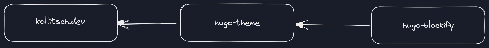

<!--lint disable no-multiple-toplevel-headings -->

This project is the website setup and content for [kollitsch.dev](https://kollitsch.dev/).

<!-- markdownlint-disable MD010 MD007 -->

<!--lint ignore-->

* [Site structure](#site-structure)
* [General notes](#general-notes)
* [License](#license)

<!-- markdownlint-enable MD010 MD007 -->

## Site structure

* [kollitsch.dev](https://github.com/davidsneighbour/kollitsch.dev) - this repository, website configuration and content
* [hugo-theme](https://github.com/davidsneighbour/hugo-theme) - the theme used for the website
* [hugo-modules](https://github.com/davidsneighbour/hugo-modules) - Hugo modules that add reusable components to any Hugo website.
* [configurations](https://github.com/davidsneighbour/configurations) - Configuration files for various tools used in this project.

This site's infrastructure is as follows:

<!--lint ignore-->

|  |  |
| --- | --- |
| **Domain Registration** | [Porkbun](https://porkbun.com/products/domains) |
| **DNS and CDN** | [Cloudflare](https://cloudflare.com) |
| **Hosting** | [Netlify](https://netlify.com) |
| **Static Site Generator** | [Hugo](https://gohugo.io) |

Feel free to [open an issue](https://github.com/davidsneighbour/kollitsch.dev/issues/new?assignees=davidsneighbour\&labels=state%3Aunconfirmed\&template=custom.md\&title=) to ask questions, discover undocumented details, or suggest improvements. [Discussions](https://github.com/davidsneighbour/kollitsch.dev/discussions) are also open directly or via commenting on articles.

## General notes

* The keywords MUST, MUST NOT, REQUIRED, SHOULD, SHOULD NOT, RECOMMENDED, MAY, and OPTIONAL in this document are to be interpreted as described in [RFC 2119](https://www.ietf.org/rfc/rfc2119.txt).
* I am working on Ubuntu, meaning all code samples in this document are working on Ubuntu and any comparable (Debian-based) Linux system. If you use another operating system, you are on your own. I assume most tools, scripts, and procedures should work on other systems with the appropriate changes because I mainly use open-source programs and scripts.

## License

This website's written `content` is licensed under the [CC BY-NC-SA 4.0](http://creativecommons.org/licenses/by-nc-sa/4.0/). In addition, the underlying `source code` used to format and display that content is licensed under the [MIT License](LICENSE-MIT.md).

While this repository is available publicly, all `content` is subject to copyright and may not be re-used or copied into other website projects. The `content` is everything in this site's `content` folder or documentation and code. Other parts of this project, like `assets` and `layouts`, are available for educational use and can be copied to your projects. You **MUST NOT** re-use the full (complete) theme, but you **MAY** use parts and principles of it.

TBD: note about fonts that might be licensed

Long story short: go and create something by yourself, and if you want to know how a feature on this website was realized, feel free to have a look or [ask](https://github.com/davidsneighbour/kollitsch.dev/discussions/new?category=questions).
