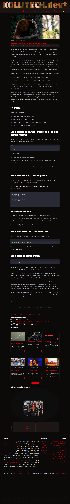

# [kollitsch.dev](https://kollitsch.dev/)

* [Features](#features)
* [Vision](#vision)
* [General notes](#general-notes)
* [Quickstart](#quickstart)
* [Commands](#commands)
* [Tech stack](#tech-stack)
* [Preview of the current state of the website](#preview-of-the-current-state-of-the-website)
* [Contributing](#contributing)

[](https://github.com/davidsneighbour/kollitsch.dev/actions/workflows/link-check.yml)
[](http://commitizen.github.io/cz-cli/) [](https://app.netlify.com/sites/kollitsch-dev/deploys)
[](https://biomejs.dev/)
[](https://biomejs.dev)
[](https://biomejs.dev)

My personal website built with Astro and Tailwind CSS. This project serves as a digital garden, blog, and reference for web development, automation, and related topics, mixed with personal insights and experiences.

## Features

* Built with Astro 5.10+ and Tailwind CSS 4.1+
* Structured content using front matter and automated pipelines
* Modular components for articles, navigation, and media
* Responsive design and accessibility focus
* Automated linting, formatting, and testing (ESLint, Vitest, Playwright)
* Content-driven: Markdown, JSON, and custom data sources

## Vision

This site is a living documentation and experimentation platform. It aims to:

* Share practical web development knowledge
* Document personal projects and experiments
* Provide reusable patterns and automation scripts
* Serve as a reference for future work

## General notes

* The keywords MUST, MUST NOT, REQUIRED, SHOULD, SHOULD NOT, RECOMMENDED, MAY, and OPTIONAL in this document are to be interpreted as described in [RFC 2119](https://www.ietf.org/rfc/rfc2119.txt).
* I am working on Linux Mint Cinnamon, meaning all code samples in this document are working on Linux Mint Cinnamon and any comparable (Debian-based) Linux system. If you use another operating system, you are on your own. I assume most tools, scripts, and procedures should work on other systems with the appropriate changes because I mainly use open source programs and scripts.
* Changes to the website and setup that are important are documented in the [release notes on GitHub](https://github.com/davidsneighbour/kollitsch.dev/releases).
* The versioning follows a more or less semantic versioning scheme. Patch releases are for bug fixes and content updates, minor releases are for new features. Major releases are done once a year --- it's a personal website after all ;]

## Quickstart

Clone and run locally:

```
git clone https://github.com/davidsneighbour/kollitsch.dev.git
cd kollitsch.dev
npm install
npm run dev
```

For more details, see the [`documentation` directory](documentation/).

## Commands

All commands are run from the root of the project, from a terminal:

| Command                   | Action                                           |
| :------------------------ | :----------------------------------------------- |
| `npm install`             | Install dependencies.                            |
| `npm run dev`             | Start local dev server at `localhost:4321`.      |
| `npm run build`           | Build production site to `./dist/`.              |
| `npm run preview`         | Preview the build locally, before deploying.     |
| `npm run astro ...`       | Run CLI commands like `astro add`, `astro check`.|
| `npm run astro -- --help` | Get help using the Astro CLI.                    |

## Tech stack

* Astro (latest)
* Tailwind CSS (latest)
* Vitest & Playwright for testing
* ESLint for linting
* Prettier & Biome for formatting

## Preview of the current state of the website

[](.github/screenshot.png)

## Contributing

Contributions are welcome. Please [open issues](https://github.com/davidsneighbour/kollitsch.dev/issues) or pull requests for improvements, bug fixes, or new content. See CONTRIBUTING.md (if available) for guidelines.
