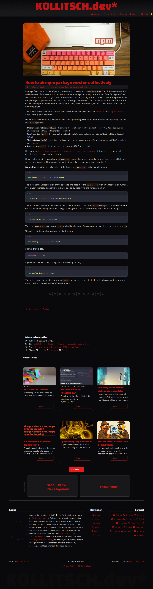

# [kollitsch.dev](https://kollitsch.dev/)

* [General notes](#general-notes)
* [Quickstart](#quickstart)
* [Commands](#commands)
* [Tech stack](#tech-stack)
* [Preview of the current state of the website (regenerated weekly)](#preview-of-the-current-state-of-the-website-regenerated-weekly)
* [Contributing](#contributing)

[](https://github.com/davidsneighbour/kollitsch.dev/actions/workflows/link-check.yml)
[](http://commitizen.github.io/cz-cli/) [](https://app.netlify.com/sites/kollitsch-dev/deploys)
[](https://biomejs.dev/)
[](https://biomejs.dev)
[](https://biomejs.dev)

My personal website, currently built with Astro and TailwindCSS. This project serves as a digital garden, blog, and reference for web development, automation, and related topics, mixed with personal insights and experiences.

## General notes

* The keywords MUST, MUST NOT, REQUIRED, SHOULD, SHOULD NOT, RECOMMENDED, MAY, and OPTIONAL are to be interpreted as described in [RFC 2119](https://www.ietf.org/rfc/rfc2119.txt). This applies to all documentation, AI instructions, agent prompts, and automation rules in this repository.

* I am working on Linux Mint Cinnamon 22.2, meaning all code samples in this document are working on Linux Mint Cinnamon 22.2 and any comparable (Debian- and Ubuntu-based) Linux system. If you use another operating system, you are on your own. I assume most tools, scripts, and procedures should work on other systems with the appropriate changes because I mainly use open source programs and scripts and not having versions on all/most OSses will most certainly lead to me not endorsing them.

* Changes to the website and setup that are important are documented in the [release notes on GitHub](https://github.com/davidsneighbour/kollitsch.dev/releases).

* The versioning follows a very sophisticated year based semantic versioning scheme. Patch releases are for bug and content fixes, minor releases are for new features and content updates. Major releases are done once a year --- it's a personal website after all ;]

## Quickstart

Clone and run locally:

```bash
git clone https://github.com/davidsneighbour/kollitsch.dev.git
cd kollitsch.dev
npm install
npm run dev
```

For more details and scattered notes about things, see the [`docs` directory](docs/), but don't expect it to be comprehensive.

## Commands

All commands are run from the root of the project, from a terminal:

| Command             | Action                                              |
| :------------------ | :-------------------------------------------------- |
| `npm install`       | Install dependencies and create cached files.       |
| `npx astro dev`     | Start local dev server at `https://localhost:4321`. |
| `npx astro build`   | Build production site to `./dist/`.                 |
| `npx astro preview` | Preview the build locally, before deploying.        |

## Tech stack

* Astro 5.16+
* Tailwind CSS 4.1+
* Vitest & Playwright for testing
* Biome for linting and formatting

## Preview of the current state of the website ([regenerated weekly](.github/workflows/update-screenshot.yml))

[](.github/screenshot.png)

## Contributing

Contributions are always welcome. Keep in mind that this is a personal website and things might be wonky for reasons beyond your imagination and you might run into opposition (--- mine ---). Please [open issues](https://github.com/davidsneighbour/kollitsch.dev/issues) or pull requests for improvements, bug fixes, or new content. See CONTRIBUTING.md (if available) for guidelines. Otherwise refer to the agents documentation in AGENTS.md.
