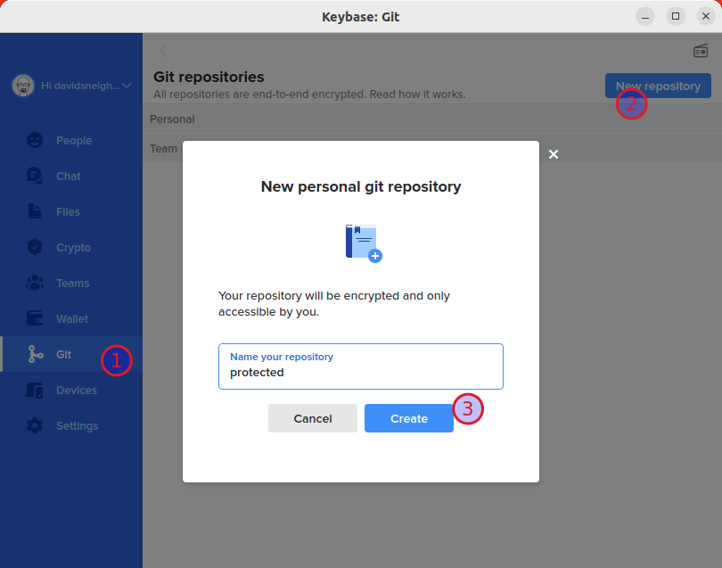

For reasons I don't want to go too deep into (I once again violated my rule to NOT install Ubuntu versions without a LTS in their name and ended up without eyes or ears) I had to reinstall my workstations and computers last week. While that sounds like hard work it isn't much of it due to [my dotfiles repository][1]. I will explain the concept of `.dotfiles` and my own implementation at a later point, for now, just know, that it's a backup of my home directory and settings for pretty much that is happening on my (Linux based) computers these days. I can re-install the programs I use and their configurations and setups with a single command. That's all ;]

One problem though were API keys and secrets that, while I had a backup, didn't make much sense to be added to the repository. Obviously it's a bad idea to add secrets, keys and passwords to a public repository. But also would it have been "private" on Github, it would only have been as private as possible until the next human error (me accidentially making it public) or hack (someone gaining access to my repositories).

Which brought me to an idea that I implemented today: Using an encrypted repository with all my keys, passwords, and (Ubuntu based) secrets.

Keybase (a secure messaging and file-sharing app) added [**encrypted** Git repositories][2] to their offers a while (some years) back.

> These repositories are real Git repositories but you can view them in the Keybase app. They’re 100% private, encrypted, and verified. You can be certain they’re safe, not only from prying eyes, but also from malicious people who might try to change your code.

The general idea is to put all private files into this encrypted Git repository and symlink them from there to the local home directory. As safe as it gets.

Sidenote: [Find out more about Keybase and how to install it][3].

This whole post expects you to have Keybase and your Dotfiles repository up and running. Done? Let's get it on:

Step 1: Create your Keybase-based Git repository either on the CLI or in the Keybase interface:

**On the CLI:**

```bash
keybase git create protected
```

This creates the repository `keybase://private/USERNAME/protected`.

**In the Keybase app:**

(1) Select the Git section, then (2) select a new personal or team repository, (3) name and create it. I chose to name it `protected` because I feel like my secrets are as protected as possible in this setup.



In the next step I checked out my new repository[^1] and added my `.env` file with API keys and secrets and other very, very private stuff not meant for the world. `davidsneighbour` is my username, use your own accordingly.

```bash
git clone keybase://private/davidsneighbour/protected protected_repo
cd protected_repo
touch .env
git add .env
git commit -m "chore(config): add .env file"
git push origin
```

The final step adds this new repository as submodule to the dotfile repository.

```bash
git submodule add keybase://private/davidsneighbour/protected protected
git add .gitmodules protected
git commit -m "chore(git): add protected submodule"
git push origin
```

And then, if you wish, some cleanup:

```bash
rm protected_repo
```

And that is all that needs to be done. Put your secret files into the encrypted repository and don't forget to push them up to Keybase, then link them from your dotfiles repository.

I should probably, in some time, write up a post about [my dotfiles repository][1], but, to be blunt, right now it's a mess and nothing to be too proud of. This whole encrypted secrets-set-up though is perfectly fine and I would advise you to implement it or some variety of it into your dotfiles hygiene :)

[1]: https://github.com/davidsneighbour/dotfiles
[2]: https://book.keybase.io/git
[3]: https://book.keybase.io/

[^1]: Careful here --- You **MUST CHECK OUT** your new repository, add a file, commit this file, then push to origin **BEFORE** you can add it as submodule. This is due to `git submodule add` failing to add empty repositories as submodules, because empty repos do not have a branch or data to be added... There are fancy ways around this, but I was to lazy to research these today :] Long story short: Don't try to add your just created repository as submodule, it will break the setup.
