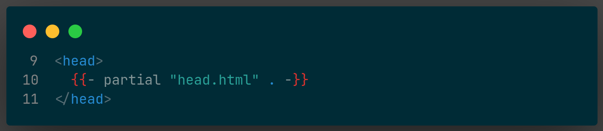

This is a GoHugo theme component that solves the old question "What tags belong into the `<head>` tag of my website?" Set it up, configure it, forget it's there. This component adds a multitude of tags and is extensively configurable.

If you want to learn about all that is possible in the `<head>` tag then have a look at [htmlhead.dev](https://htmlhead.dev/) --- or just trust this module to do "all the right things".





## General setup

Set up `hugo-head` by adding it to your `head` tag and remove all other tags from your `head` -- they are included in `hugo-head`. Then configure the module, setup all other features and forget about it.

`hugo-head` uses opiniated defaults that can be overridden via configuration.


[dnb.head]
charset = "utf-8"
viewport = "width=device-width, initial-scale=1"
nobase = false


- `charset`: Sets the global charset for the page. Do not set or change this if you have no reason for it. UTF8 is the proper way to encode your content. If your content (language, encoding) is located in a multibyte region this might change to UTF16 or UTF32.
- `nobase`: Use the websites BaseURL as base tag. This means all relative links will be based on this URL. Depending on your way of writing markup this might be useful to fix local links and references. If you keep this setting out of your configuration then the base-tag will be set to your BaseURL setting. Set it to true and no `base` tag will be used, all references on any page will be based on that pages URL.
- `viewport`: This is a tag that defines how to display the website on various devices and with what setup. If you don't know about this, then keep it out of your config and the best default setting will be used.

## `title` and `description` generation

The title will be generated from the title frontmatter of the content file. If we are on the home page the site title is used. On subsequent listpages a `(Page n)` is added. On all pages except the homepage a separator and the sites title is added at the end.


[dnb.head]
separator = " | "


The title generation is able to add a "(page n)" to the title on list pages if you save your pagination dictionary in a scratch called `paginator`. The following would be a sample of how to accomplish that:


{{- $paginator := dict -}}
{{- if eq "home" .Kind -}}
  {{- $paginator = $.Paginate (where site.RegularPages "Type" "in" site.Params.mainSections) -}}
{{- else if .IsNode -}}
  {{- $paginator = $.Paginator -}}
{{- end -}}
{{- .Scratch.Set "paginator" $paginator -}}


It is also possible to add an additional `sectiontitle` between page and site title. This is set via `sectiontitle` frontmatter. Either add that value individually per page or via `cascade` in the section's `_index.md`.

The description is generated from the description frontmatter of the content file. If no description is configured then `site.Params.description` is used.

## Speed optimisation

To be written.

## Author generation

The author tags generation is quite small still, but expect larger changes in the future. Right now `hugo-head` can transform the following configuration parameters into header tags that add author information:


[author]
name = "name"
email = "email"
homepage = "website"


If you are using [`hugo-humans`](https://github.com/davidsneighbour/hugo-humans) then it will integrate the [required header tags](https://github.com/davidsneighbour/hugo-humans) automatically for you. Don't forget to individually [configure the module](https://github.com/davidsneighbour/hugo-humans#configuration) in your configuration.
If you are using [`hugo-publisher`](https://github.com/davidsneighbour/hugo-publisher) then it will integrate the [required header tags](https://github.com/davidsneighbour/hugo-publisher) automatically for you. Don't forget to individually [configure the module](https://github.com/davidsneighbour/hugo-publisher#configuration) in your configuration.

## Stylesheets

`hugo-head` adds a simple stylesheet pipeline to your website. It expects a SCSS entry point in `assets/scss/style.scss` or any other configured entry point.


[dnb.head.styles]
entrypoint = "scss/theme.scss"


### Stylesheet with SCSS via PostCSS

To be written.


[dnb.head.styles]
method = "postcss"

[dnb.head.styles.options]
outputStyle = "compressed"
targetPath = "assets/theme.css"
enableSourceMap = true
includePaths = ["node_modules/"]


options for the compilation of CSS --- see <https://gohugo.io/hugo-pipes/scss-sass/#options>

## Translations

If the current page has a translation then it will be linked in your header. I don't see anything that requires configuration here, so please open a new issue if you need specific setups.

## SEO

To be written.

## Series

If the current page has a page following or coming before then `hugo-head` will automatically create links to those pages in the header. It uses the `.PrevInSection`/`.NextInSection` links for this.

## Social Graph

If you are using [`hugo-social`](https://github.com/davidsneighbour/hugo-social) then it will integrate the [required header tags](https://github.com/davidsneighbour/hugo-social) automatically for you.

## Open Search

If you are using [`hugo-opensearch`](https://github.com/davidsneighbour/hugo-opensearch) then it will integrate the [required header tags](https://github.com/davidsneighbour/hugo-pwa#setup-layouts) automatically for you. Don't forget to individually [configure the module](https://github.com/davidsneighbour/hugo-opensearch#configuration) in your configuration.

## PWA

If you are using [`hugo-pwa`](https://github.com/davidsneighbour/hugo-pwa) then it will integrate the [required header tags](https://github.com/davidsneighbour/hugo-pwa#setup-layouts) automatically for you. **Note**, that it does NOT include anything in the footer, so these tags still need to be added in your own templates.

## Verification

`hugo-head` can add verification-meta-tag to your header for any of the following services. Just add the value of the meta-tag to your configuration.


[dnb.head.verification]
google = ""
yandex = ""
bing = ""
alexa = ""
pinterest = ""
norton = ""


**Note: You should prefer to verify your ownership via a file in your site root or via DNS record to minimise the output on your pages. The less headers you have the better.**

## Alternates

`hugo-head` prints all configured alternate links for a page. If you find alternates for output types you do not wish to include, then you have configured your output format wrong. Have a look at the documentation of [`notAlternative`](https://gohugo.io/templates/output-formats#configure-output-formats) and [how to enable/disable output formats](https://gohugo.io/templates/output-formats/#customizing-output-formats).

## Others

`hugo-head` can add various obscure and weird other tags to your headers. You can enable and disable them by setting the following parameters. Think about the usefulnes of these tags though, less is more again.


[params.dnb.head.verification]
disable = ["referrer", "phone_transcription"]
notranslate = false
monetization = ""
latitude = ""
longitude = ""
region = ""
placename = ""


## Hooks

`hugo-head` implements template hooks via [`hugo-hooks`](https://github.com/davidsneighbour/hugo-hooks) and provides the following hooks:

<!-- prettier-ignore -->

| Hook | Description |
| --- | :--- |
| head-init | hooks in after the opening `head` tag. Do not open this to output anything. Just to initialise any of your plugins. |
| head-start | hooks in after the initial first tags that belong at the beginning of your `head` section. |
| head-post-speed-optimisation ||
| head-post-description ||
| head-post-author ||
| head-pre-css | hooks in before the stylesheets are printed. |
| head-post-css | hooks in after the stylesheets are printed. |
| head-post-translations ||
| head-post-seo ||
| head-post-series ||
| head-post-* ||
| head-post-alternates ||
| head-post-verification ||
| head-end | hooks in at the end of the `head` right before the closing tag. |


## Sites and Projects using `hugo-head`

- [Kollitsch.de](https://kollitsch.de)
