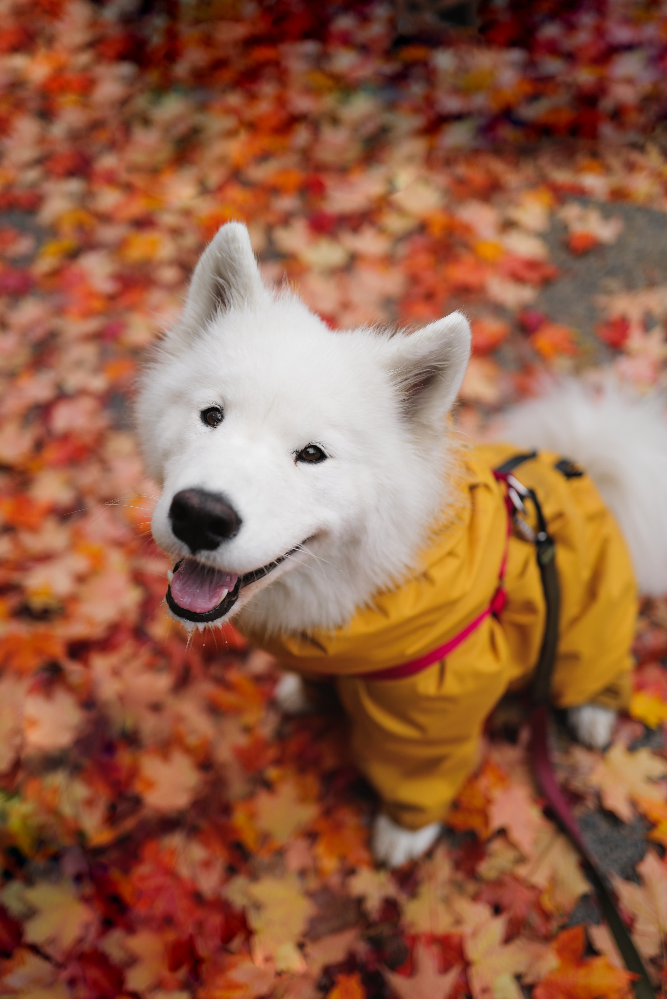

This component for [GoHugo](https://gohugo.io/) adds partials and shortcodes to resolve and process images on your website. It offers responsive image formats and optimised loading based on current browser abilities.

The simplest way is to use this module as a drop-in. Just install it and forget you ever did. It will work out of the box with the default settings and replace the internal handling of image markdown (``) and the `` shortcode. You can adapt it's features to your needs by using the partials and global configuration options.


Check back for better documentation and more features. The following documentation is, as long as this note is here, only partial and might be missing important points. If you have any questions, or ideas, please [add an issue to the issue tracker](https://github.com/davidsneighbour/hugo-blockify/issues).

ToDo:

- [x] markdown render hook for images
- [ ] image shortcode
- [ ] gallery shortcode
- [ ] testing framework
      

- [Notes](#notes)
- [Shortcodes](#shortcodes)
  - [Figure](#figure)
    - [Parameters](#parameters)
    - [Notes](#notes-1)
  - [Gallery](#gallery)
    - [Parameters](#parameters-1)
- [Partials](#partials)
  - [Figure](#figure-1)
  - [Gallery](#gallery-1)
- [Global Configuration](#global-configuration)
- [Optimisation](#optimisation)
- [Further Readings](#further-readings)
- [Usage Examples](#usage-examples)
  - [Markdown Render Hook](#markdown-render-hook)
  - [Gallery Shortcode](#gallery-shortcode)
  - [Image Shortcode](#image-shortcode)
- [Sample Photo Sources](#sample-photo-sources)

## Notes

- Image processing (aka. resizing, filters, cropping etc) is only available in Global and Page Resources. Global Resources are located in the `assets` folder of your repository, Page Resources are located within the `content` directory with your content files in so called Page Bundles. The images in your `static` directory are loaded as they are, not processed (other than evaluation of content type and sizing) and will not result in responsive image tags. All other features or options will work.
- Lookup order of images:
  - page bundle
  - global resources (`assets` folder)
  - static folder
  - after that, a warning about the image not being found is issued on CLI and on the page itself it fails silently
- Using the `name` attribute implies that page resources are used, and no further lookup will be done if the image is not found in the page bundle.

## Markdown

This module implements a markdown render hook for GoHugo that resizes and prepares HTML for responsive images. It is the simplest way to use this module. Just install it and forget you ever did. It will work out of the box with the default settings and replace the internal handling of image markdown (``).

## Shortcodes

Available shortcodes currently are `image`, `figure` and `gallery`. Those shortcodes are served by partials that you can use in your own layout files with more extensive configurability. `figure` overrides the GoHugo internal `figure` shortcode. All shortcodes add responsive image processing and markup to your website.

### Figure

Possible call scenarios:

With unnamed parameters (static images preferred):

```go-html-template


```

With named parameters:

```go-html-template

caption
caption
```

#### Parameters

| Option       | Type   | Notes                                                                                                                                                             |
| ------------ | ------ | ----------------------------------------------------------------------------------------------------------------------------------------------------------------- |
| `name`       | string | Resource name to show (_required_, if no `src` parameter is used, resources are defined in frontmatter or it's the filename of the image in a page bundle)        |
| `src`        | string | Image to show (_required_, if no `name` parameter is used). must be relative to the static folder                                                                 |
| `link`       | string | Links the image to an URL                                                                                                                                         |
| `linktarget` | string | Target of the link (_optional_, default is to open the link in the same tab. Typically you would want `_blank` as value for a new window, but anything goes here) |
| `class`      | string | Additional classes for the image (_optional_)                                                                                                                     |
| `alt`        | string | `alt` attribute for the image (_optional_, suggested)                                                                                                             |
| `title`      | string | `title` attribute for the image (_optional_)                                                                                                                      |
| `command`    | string | Command for image processing (_optional_, required with `options`)                                                                                                |
| `options`    | string | Options for image processing (_optional_, required with `command`)                                                                                                |
| `width`      | number | Width of the image (_optional_, could be evaluated from the resulting image)                                                                                      |
| `height`     | number | Height of the image (_optional_, could be evaluated from the resulting image)                                                                                     |

#### Notes

**Tagvariants:**

```go-html-template
Something

```

The two samples above have the same output. Using the `title`-attribute removes the requirement to add a closing tag. But you can add as much markdown/formatting to your caption by using an opening and closing tag for the shortcode. While the title tag is "markdownified", this might be an easier way to add more complex content to your caption.

**Commands:**

TODO: Currently this allows for only one `command`/`options` combination. The future way will be to add an "array" of commands and options that are executed successively.

**Image Shortcode:**

The `` shortcode is a synonym for the `` shortcode and has the same features/options. It is added for compatibility with older implementations and themes.

### Gallery

to be written.

Notes: right now it expects a galleryid parameter for a folder inside of pagebundle/gallery/galleryid and a type for bootstrap4 or bootstrap5. All images in that directory are parsed and shown. No sorting (todo), no gallery selection by frontmatter (todo).

#### Parameters

| Option | Type | Notes |
| ------ | ---- | ----- |
|        |      |       |

## Partials

### Figure

The figure partial executes the markdown creation of single images and can be called with an options dictionary of the following content:

```json { single=true }
{
 "name": "",
 "src": "",
 "height": 100,
 "width": 100,
 "title": "",
 "alt": "",
 "class": "",
 "link": "link to put the image in, param `link` required on the shortcode",
 "caption": "markdownified content of .Inner, used for the caption of the image",
 "srcset": "",
}
```

### Gallery

To be written.

## Global Configuration

To be written.

```toml
################################################################################
# hugo-pictures
################################################################################
[dnb.pictures]
default_image = "images/og_sitewide.png"
# 16:9, 4:3, 1:1 or whatever ratio you want for thumbnails
# this needs to be a string and needs to be two floats separated by a colon
# aspect_ratio = "16:9"
# changing this requires changes in assets/scss/components/_figure.scss
aspect_ratio = "2:1"
[dnb.pictures.responsive]
# collection of image sizes for responsive image sizes. this takes the aspect_ratio
# above into account, so only the long side length is required here.
[dnb.pictures.responsive.fullwidth]
image_sizes = ["494", "517", "674", "914"]
break_points = ["520", "540", "720", "960"]
[dnb.pictures.responsive.halfwidth]
image_sizes = ["494", "517"]
break_points = ["520", "540"]
```

## Optimisation

To be written.

Notes about:

- resources directory
- caching (with hugo-netlification)
- preloading (needs implementation)
- maybe a walkthrough how this module implements current features?

## Further Readings

- [A list of up to date best practices for web images by nucliweb](https://github.com/nucliweb/image-element) (those practices are all implemented in this module)

## Usage Examples

### Markdown Render Hook

```markdown

```


```markdown

```


```markdown

```


```markdown

```


```markdown

```


### Gallery Shortcode

```markdown

```



### Image Shortcode

```markdown

```



```markdown

```



## Sample Photo Sources

- [Good Dog 1](https://unsplash.com/photos/PjgeDNHhg_8), [Good Dog 2](https://unsplash.com/photos/itru42lAV6E), [Good Dog 3](https://unsplash.com/photos/ah63B7-mo3w), [Static Cat](https://unsplash.com/photos/YQlNLVYckRk), [Assets Cat](https://unsplash.com/photos/67HBaxCvA8M) --- License: [Unsplash+ License](https://unsplash.com/plus/license)
