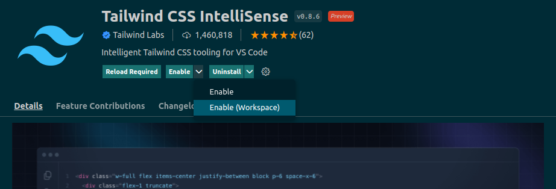
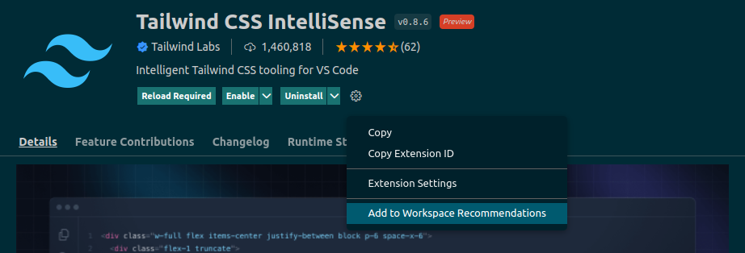

I am one of these kind of people that install plenty of extensions and tools and experiment around in VSCode (or any other code editor I am working with). Some time ago I realised, that this lead to a slow program and many of these plugins are only useful for a limited number of projects. So I deleted everything and restarted from scratch.

A week later I was back where I was before: Too many extensions, many of them useless for most projects. This is probably an issue every fullstack developer experiences once it gets to the details. I have projects where I need Golang support, or PHP support, or Docker support, or WordPress support, or whatever support… It fills up.

Well, after some clicking around I found an interesting new strategy to cope with "extension overflow". While I was clicking around I found, that on the extensions screen, in any extension, we can find an "enable/disable" button. This button has a dropdown and hides a sub selection "enable/disable (Workspace)". Yay! VSCode allows a workspace specific extension setup. Which lead me to the following "workflow" on new installations:

* install the extension
* disable the extension
* enable the extension for the workspace I require it in
* add the extension to the recommended extensions for this workspace
* save `.vscode/extensions.json` and `workspacename.code-workspace` in my repository

To add the extension to the recommended extension click the little gearwheel at the end of the function buttons and select "Add to Workspace Recommendations". This will either create a file `.vscode/extensions.json` with this extension or adds the extension to the existing list of recommendations. Add this file to your repository. The next time you will initially open this repository on a new workstation a message will pop up and ask if you want to install recommended extensions.

This way I end up with exactly the functionality I need per project and still have all the plugins up-to-date and available if needed. VSCode shows what I need when I need it. Nice.

Note 1: I am not sure if that is a default setting but it seems that disabled extensions are not automatically updated anymore. This can easily be changed by using <kbd>CTRL+SHIFT+P<kbd> (or <kbd>CMD+SHIFT+P<kbd>) to bring up the functions browser of VSCode and then searching for `auto update`. The function "Enable Auto Update for all extensions" will take care of the updating in the background.

Note 2: It appears that the extensions enabled per workspace are not saved somewhere in `.vscode` or the `*.code-workspace` file itself, but inside of the `~/.config/Code` directory --- which will lead to these extensions being not automatically in workspace-only mode when the are installed via the recommended extensions functionality. This means I will have to reinstall all recommended extension, then go through the steps above again (disable, enable per workspace) to get back to the current state. It [does not appear](https://github.com/microsoft/vscode/issues/15611) that this will change.
