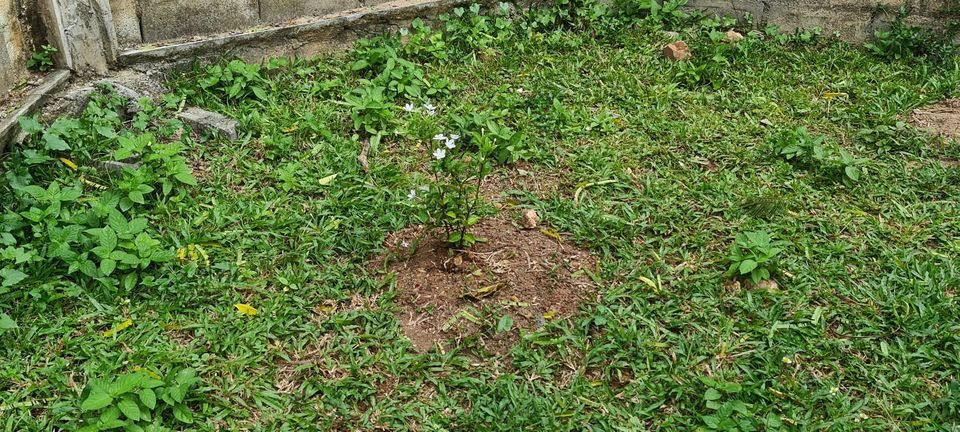

I am trying this new "thing" of "reporting" what I was up to in a certain time period this year, and monthly reviews just sound like something normal people would do. So bear with me while I am typing up this report.

* **Focus:** I didn't had much focus this month due to travelling and subsequent "other" life events. I dove into work and smaller things to fix. July will go better I guess.
* **Pokki:** well…
  
* **Language Learning:** Not much done on this front either.
* **All the other stuff:** As always there was a lot of things that I just ignored or let slide. That's life. I guess.
