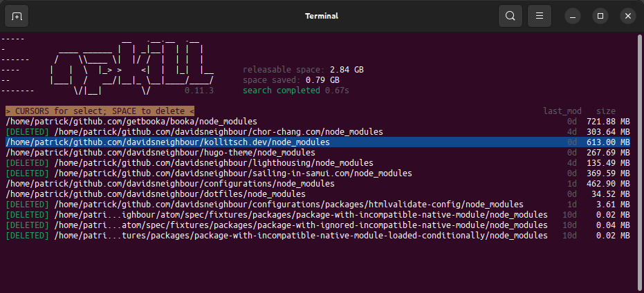

If you are like me a developer that uses lots of npm packages you will know the amount of mega- or even gigabytes that are used up by `node_module` directories in every project. Having to remove them all tediously by hand or keeping them - both solutions are annoying, when you try to backup your projects - is just annoying.

Happily enough I discovered [`npkill`](https://github.com/voidcosmos/npkill) a while back. It is a command line tool that helps you to find and remove old and heavy node\_modules folders, freeing up valuable space on your machine.

Its key features are:

*   cleaning up space, oviously
*   showing you the last time the project was updated
*   a very fast execution time to locate all `node_modules` directories
*   it's easy to select and delete the folders you want to remove
*   the tool itself has minimal dependencies, keeping it lightweight and its own `node_modules` directory small

To install npkill globally, run the following command:

```bash
npm install -g npkill
```

Once installed, you can use npkill by executing the command `npkill` in your terminal. It will scan for node\_modules directories starting from the current path and display a list of them along with their sizes. You can navigate the list using arrow keys, and delete selected folders by pressing Space or Del.



Note: some applications may rely on those folders. `npkill` will highlight these folders and displays warnings to help make informed decisions.

As it's still under development, it should be used with some degree of caution. I have used it for a while now and it works great for me. I have not encountered any problems so far.
