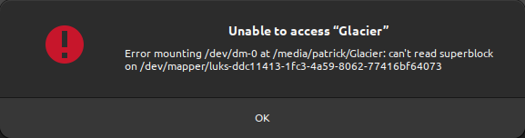

On my desk, I have a 20TB external hard drive, which is encrypted using [LUKS](https://gitlab.com/cryptsetup/cryptsetup). This is the default on Ubuntu when you choose to encrypt your hard drive during installation or when you format a drive using the Disks utility and choose encryption.

This setup worked quite nicely for me until it didn't. Imagine my surprise and dismay when I was greeted with the following message while trying to access my external hard drive:



*Error mounting /dev/dm-0 at /media/username/mountname: can't read superblock on /dev/mapper/drivename* typically means an encrypted hard drive has a broken superblock.

> **What is a superblock?**
>
> A superblock is a vital part of a filesystem, acting like a directory. It holds key information about the filesystem's size, structure, and status, such as where to find files and free space. It's like a map for the operating system to navigate and manage the data on a storage device. If the superblock is damaged, accessing files becomes challenging, like finding a chapter in a book without a table of contents.

Recovering an encrypted hard drive in Ubuntu can be a daunting task. Still, it's entirely feasible with the right commands and understanding of what they do. I decided to not just wing it and reformat everything.

Let's dive into the process, and see how I recovered my drive - and its data.

## Notes/Requirements

* The drive (the `/dev/mapper/luks-` part of the error message) is called `/dev/mapper/luks-drive` in this example.
* Root or `sudo` access is required.

## Step 1: Check information about the hard drive

First, we identify backups and superblocks.

**Command:**

```bash
dumpe2fs -h /dev/mapper/luks-drive
```

**Example Output:**

```plaintext
dumpe2fs 1.46.5 (30-Dec-2021)
Filesystem volume name:   Glacier
Last mounted on:          /media/patrick/Glacier
Filesystem UUID:          883d30a6-b7a7-4fd0-9c0e-50583b5b67dc
Filesystem magic number:  0xEF53
Filesystem revision #:    1 (dynamic)
…
```

This output provides detailed information about the file system, including the last mount point, UUID, and other critical details.

Interesting parts are, for instance the markers that explain more about probable errors:

```plaintext
Filesystem state:         clean with errors
Errors behavior:          Continue
FS Error count:           2
First error time:         Sun Nov 26 13:36:01 2023
First error function:     htree_dirblock_to_tree
First error line #:       1080
First error inode #:      141951337
Last error time:          Sun Nov 26 13:36:01 2023
Last error function:      ext4_journal_check_start
Last error line #:        83
```

Well, seems like we have some issues ;)

## Step 2: Identify available superblock backups

Next, we gather information about the available superblock backups.

**Command:**

```bash
LANG=C sudo dumpe2fs /dev/mapper/luks-drive | grep -i superblock
```

This command uses `sudo` to read the drive information and does not change anything on the drive. The `LANG=C` part is required to ensure the output is in English.

**Example Output:**

```plaintext
dumpe2fs 1.46.5 (30-Dec-2021)
  Primary superblock at 0, Group descriptors at 1-2329
  Backup superblock at 32768, Group descriptors at 32769-35097
  Backup superblock at 98304, Group descriptors at 98305-100633
  Backup superblock at 163840, Group descriptors at 163841-166169
  Backup superblock at 229376, Group descriptors at 229377-231705
…
```

This output shows the primary superblock location and the locations of (in my case, 24) backup superblocks. One of them *must* be good, I guess ;)

Note the `31768` in the first backup superblock location. This is the backup we will be recovering in our next step.

## Step 3: Recover the drive using the latest superblock backup

Now, we use `fsck.ext4` to repair the file system using the backup superblock we identified in step 2.

**Command:**

```bash
sudo fsck.ext4 -b 32768 /dev/mapper/luks-drive
```

**Example Output:**

```plaintext
e2fsck 1.45.5 (07-Jan-2020)
/dev/mapper/luks-drive: recovering journal
Clearing orphaned inode 12345 (uid=1000, gid=1000, mode=0100644, size=123456)
…
/dev/mapper/luks-drive: clean, 11/65536 files, 12345/262144 blocks
…
```

This output indicates that `fsck.ext4` is repairing the file system, clearing orphaned inodes, and recovering the journal. This took quite a while. In my case, hours, because the hard drive is 20TB large and all sectors were probed and recovered.

The process also asks if you wish to recover broken sectors, which, in my case I answered with `y` for yes. After a bunch of those questions I was mentally ready to complain because of the amount of questions, but I realised, that these questions can be answered with an `a` for yes to all. So I did that and let fsck.ext4 save the day.

## Step 4: Mount the hard drive and move on with your life

After these three steps

## Next steps

* How are those those superblock backups created and configured (how often, when, and where to back up)?
* How can a LUKS partition be resized? I have a 20TB drive, and only need it some to be encrypted. Having the private data encrypted is enough.
