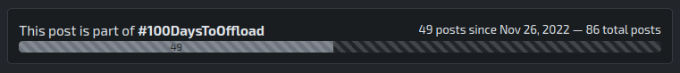

As I reported a while ago, I embarked on an exhilarating journey with the [#100DaysToOffload challenge](https://kollitsch.dev/blog/2022/100-days-to-offload/), a quest to enrich my blog with 100 posts within a year.

However, I realized that while I have had 80+ posts since then, I still have yet to write that many posts *within a year*, which is the original postulation of the challenge - quite a misrepresentation.

> The whole point of [#100DaysToOffload](https://100daystooffload.com/) is to challenge you to publish 100 posts on your personal blog in a year.

So, I will clearly show on the progress bar now how many posts I've written in the current year (the past 365 days at the time of the latest post) and remind myself of this fact. I only show the total number of posts in this section since March 21st, 2022, when I started, as info, as it is unfair to count them towards the challenge.

Statistically speaking, I will need to write two posts per week, which is too much currently, mostly because I live in the real world. But I will catch up and see how far I can get. I started "recently" (around 6+ months or so) to write about more minor issues I came across, and I think that is an excellent way to keep the posts coming. I also have a few ideas for more extensive posts, but I need time to write them down.

Long story short: #100DaysToOffload is a great challenge, and I will keep up with it, but it might be around on this little blog for a bit longer. The challenge is more than just a numbers goal; it's a journey of discovery and growth. While it may take me longer to finish, this challenge will continue to be a part of my blog.
