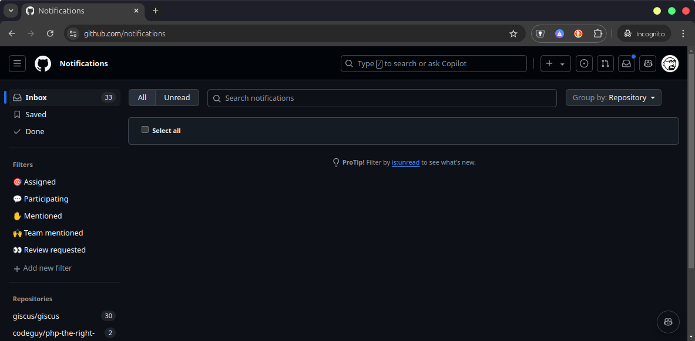
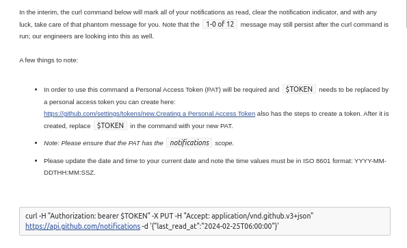

Every now and then my inbox in Github shows x total unread updates without having actual updates. When I click on it, there are no unread notifications. This is a known issue and it's been around for a while. The notifications are called "ghost notifications" and they are not visible in the UI. They are only visible in the API and have probably already their own support response template.



Even clicking around and loading any separate repository that indicates having updates does not clear them. The only way to clear them is to use the API --- which is why I now have a bash function that does this for me.



To make this work you need an personal Github token - not the new format, but the old one. It needs to have the `notifications` scope. You can create one in your [developer settings](https://github.com/settings/tokens). More about the [notifications API](https://docs.github.com/en/rest/activity/notifications?apiVersion=2022-11-287). Put it in your `.env` file. or remove lines 2-6 and make the token available in your preferred way.

Then add the following function to your `.bashrc` setup.

```bash
g_clear_inbox() {
  FILE=${HOME}/.env
  if [ -f "${FILE}" ]; then
    # shellcheck disable=SC1090
    source "${FILE}"
  fi

  now=$(date -u +%FT%TZ)
  if [ -n "${GITHUB_NOTIFICATIONS_TOKEN}" ]; then
    curl -X PUT \
      -H "Authorization: Bearer ${GITHUB_NOTIFICATIONS_TOKEN}" \
      -H "Accept: application/vnd.github.v3+json" \
      -d "{\"last_read_at\": \"${now}\"}" \
      https://api.github.com/notifications
  else
    echo "Error: GITHUB_NOTIFICATIONS_TOKEN is not set in .env."
  fi
}
```

Running `g_clear_inbox` will then mark all notifications as read. This is a destructive action and cannot be undone. So use with caution. I run it on my empty inbox after I am done with all notifications.

I expect this to change, given that we call those Github tokens "classic" these days ;)
