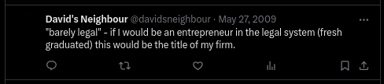

A while back (about 15 months ago), I stopped using Twitter. At first, I thought I might delete my account, but then I realized that somewhere along the lines, Twitter has begun to enforce a "you have to have an account to watch this content" rule. So I decided to keep my account but delete all my tweets, retweets, likes, and unfollow people.

A long time ago, in the summer of 2006, I made first contact with Twitter. Back then we called it Twttr and received notifications of every new post via SMS. It was a different time, and I was a different person. Social Networks were social. It was also my first "API" project (well, curl with regular expressions and a nice MySQL database). *Those were the times…*

There are plenty of tools to mass-unfollow people on Twitter, so let's not go there. I unfollowed everyone, and after a while, my timeline was full of cats, dogs, and weird politicians.

I didn't want to delete my tweets by hand (I tried, but it required plenty of clicks and often failed due to some form of rate limiting and general instabilities and bugs), so I ended up using the Chrome extension [Delete Twitter](https://chrome.google.com/webstore/detail/plolbhegbeapkdmpnbabilmfnknlfbpa) to delete all my tweets. It took a while, but it worked. Because the extension doesn't work with the Twitter API and basically simulates clicks on the interface, there were no rate limits or other issues. [It just took a while](https://www.youtube.com/shorts/KNN8wPgKsGE), and every now and then, I had to wait for an hour or restart the process.

After a while, "all" tweets were deleted. All tweets? No, not all tweets. There were some undeleteable tweets left that I removed by hand. Twitter also still showed around 2000 tweets and 200 likes on my profile. So I visited again and again over time, and after about two weeks, the missing items appeared. I deleted them and now have 27 posts and 4 likes that don't exist but are still counted, maybe in a week or so.

My Twitter profile of nearly 2 decades is empty, and I can move on. See you down somewhere on the social…

And here, for posterity's sake, is my all-time most funny, sarcastic tweet. That was the highest point of my Twitter life. I am ashamed. Because, you know, freshly vs. fresh ;)

