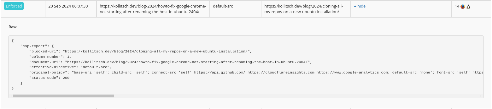

While I was working on my Content Security Policies (CSP) [last week](https://github.com/davidsneighbour/kollitsch.dev/issues/1211) I found some of my pages hitting a block for my own pages on `default-src 'none'`. After some digging, I found that this error only came up on Firefox browsers. 

It turned out, that there is [a known bug](https://bugzilla.mozilla.org/show_bug.cgi?id=1773976) or [feature](https://developer.mozilla.org/en-US/docs/Web/HTTP/Headers/Content-Security-Policy/default-src#firefox_default-src_none_svg_sprite_blocking_issue) (depending on who you might ask) where Firefox treats SVG sprites as external documents rather than images when they are loaded via ``-tags. This means that if you have a CSP that blocks all external resources, Firefox will block the SVG sprite from loading. 

The interesting thing for me was, that it was not a problem on `image-src` or any other explicit directive, but directly on the `default-src` directive.

[](default-src-report.png)

When implementing a Content Security Policy (CSP) to secure your website, a common recommendation is to start with a restrictive policy like `default-src 'none'`. This approach ensures that no external resources are loaded unless specifically allowed. A typical setup might look something like this:

```ini
Content-Security-Policy: default-src 'none'; img-src 'self';
```

This is a great start for locking down your resources, but if you're using **SVG sprites** defined in external files and referencing them in your HTML via the `<use>` element, you might run into the problem I was running into: **SVG images being blocked in Firefox**.

The problem is this HTML pattern:

```html
<svg>
  <use href="/images/icons.svg#icon" />
</svg>
```

In most modern browsers, this works fine when you've set your CSP to allow image loading from the same origin with `img-src 'self'`. However, Firefox handles things a bit differently. Here, the SVG file is not treated as an embedded image, but as an external document. As a result, the `img-src 'self'` policy will not apply, and the sprite is blocked.

(A comparable thing is happening with font files that are linked and treated as external documents. In those cases we have the `crossorigin="anonymous"` attribute to help with the loading.)

In essence, Firefox requires a more permissive policy than other browsers when it comes to external SVG sprites.

How can we solve this issue:

**Method 1: Set `default-src 'self'` instead of `default-src 'none'`**

One fix is to allow the loading of external resources from the same origin by modifying the `default-src` directive:

```ini
Content-Security-Policy: default-src 'self'; img-src 'self';
```

This change will ensure that external SVG files hosted on your domain (such as `/images/icons.svg`) can be loaded across all browsers, including Firefox. While this is a more permissive policy, it still restricts external resource loading to the same origin, maintaining a decent level of security. If you are ok with "decent".

**Method 2: Keep `default-src 'none'` and inline the SVG sprites**

If you have a strict requirement to maintain `default-src 'none'`, you can opt to inline your SVG sprites directly in your HTML instead of loading them externally.

```html
<body>
  <!-- Inline the SVG sprite anywhere in the document -->
  <svg style="display: none">
    <symbol id="icon" viewBox="0 0 24 24">
      <path d="M10 20v-6h4v6h5v-8h3L12 3 2 12h3v8z" />
    </symbol>
  </svg>

  <!-- Use the inlined SVG icon -->
  <svg>
    <use href="#icon" />
  </svg>
</body>
```

By inlining the SVG code, you eliminate the need for external files, which means **no CSP rules are violated** and the sprite will work flawlessly across all browsers, including Firefox.

I chose the second method, as I wanted to keep my CSP as restrictive as possible.

**TL;DR**

Firefox blocks external SVG sprites when using `default-src 'none'` in your CSP. Inline them in the HTML to bypass the issue. 
