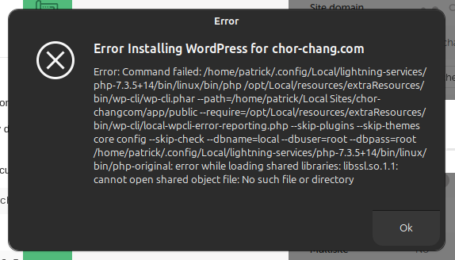
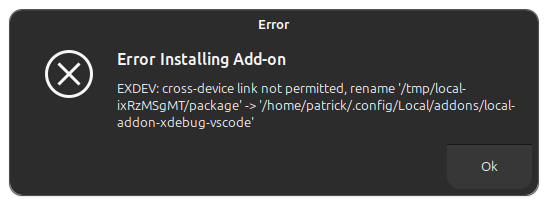

[Local](https://localwp.com/) (or LocalWP as I like to call the program so I can find it on Google when I need it) is a developer-friendly local development tool for WordPress sites (think of containers for each WordPress website you work on). It allows developers and designers to quickly create, configure, and manage local WordPress environments, offers features such as one-click WordPress installations, flexible environment configurations, and [seamless integrations with two hosting providers](https://localwp.com/connect/) (Flywheel and WP Engine). But also easy export and import to use the websites with other providers.

I find it particularly useful to keep WordPress websites up to date and do quick fixes to common problems or change some copy. With its many add-ons, it is also useful for regular audits, optimizations, and updates to new WordPress features.

Wouldn't it be great if it would work properly out of the box in [Ubuntu 24.04](/tags/ubuntu-24.04/)?

*It doesn't.* A lot of programs I was using before stopped being installable on Ubuntu's latest LTS version. Here are my steps to get LocalWP to comply with Ubuntu.

### Problem 1: Installation of LocalWP on Ubuntu 24.04 fails due to missing packages

Trying to install the [downloaded *.deb file]() results in an error about missing packages. This happened before too, but *back then* one could run `sudo apt install -f` to fix broken packages and all was good. Under Ubuntu 24.04, this resulted in removal of the broken program, instead of installing the missing packages.

This is due to these required packages being removed in the latest Ubuntu.

With a little search and fingerwork, these issues can be fixed by downloading the missing packages and installing them manually before attempting to install LocalWP itself.

The error messages about missing packages can differ, but the way to fix them is always the same: Do a search on [Launchpad](https://launchpad.net/) for the missing package, download it, and install it. If any of these install attempts seemingly fails, try running `sudo apt install -f` to see if missing dependencies can be installed automatically.

In my own journey to get it working, I came across these 4 missing libraries (only install those missing in your own user case, no need to put stuff on your system you don't really require):

**[libtinfo5_6.4](https://launchpad.net/ubuntu/lunar/amd64/libtinfo5/6.4-2)**

```bash
curl -O http://launchpadlibrarian.net/648013231/libtinfo5_6.4-2_amd64.deb
sudo dpkg -i libtinfo5_6.4-2_amd64.deb
```

**[libncurses5_6.4](https://launchpad.net/ubuntu/lunar/amd64/libncurses5/6.4-2)**

```bash
curl -O http://launchpadlibrarian.net/648013227/libncurses5_6.4-2_amd64.deb
sudo dpkg -i libncurses5_6.4-2_amd64.deb
```

**[libaio1_0.3.113](https://launchpad.net/ubuntu/lunar/amd64/libaio1/0.3.113-4)**

```bash
curl -O http://launchpadlibrarian.net/646633572/libaio1_0.3.113-4_amd64.deb
sudo dpkg -i libaio1_0.3.113-4_amd64.deb
```

**Important:**

- Don't install packages you don't need, only those that throw errors when installing the LocalWP package.
- Look out for the required version and find it in Launchpad. The versions above were the ones working in my case, but that might change depending on your local installation, system architecture, and requirements.

### Problem 2: Installing older PHP versions in LocalWP fails with libssl errors



This points to PHP being unable to run due to `libssl.so.1.1` being missing. This problem too can be fixed by locating the package on Launchpad and installing it manually:

**[libssl1.1](https://packages.ubuntu.com/focal/amd64/libssl1.1/download)**

```bash
curl -O http://security.ubuntu.com/ubuntu/pool/main/o/openssl/libssl1.1_1.1.1f-1ubuntu2.22_amd64.deb
sudo dpkg -i libssl1.1_1.1.1f-1ubuntu2.22_amd64.deb
```

After that, the setup of older PHP versions will work and you can start creating your local WordPress sites.

### Problem 3: Add-ons can't be installed due to unavailability of the TEMP_DIR

Trying to install one of the add-ons in Local might result in the following error:



The issue here is that on many Linux installations, handy users have created partitions that they are mounting together to create a filesystem tree. Sometimes the global temporary directory, where any program can save files, is located on a different directory than the user's home directory, where Local is running. I, for instance, have two partitions, one with the system root (`/`) and one with the home directories (`/home`) so that my personal files can be reused when I have to newly install the system.

The fix that helped get add-on installations finally working was to set the global `TEMP_DIR` variable to a directory within my home directory before starting Local:

```bash
mkdir -p ~/.config/Local/tmp
export TMPDIR="${HOME}/.config/Local/tmp"; /opt/Local/local
```

Because I am lazy and forget things, I write myself a little Bash script that creates this setup and adds a starter script to override the start menu script with a working version.

```bash
create_local_desktop() {

  local DEFAULT_TEMP_DIR="${HOME}/.config/Local/local-tmp-folder"
  local DEFAULT_BINARY="/opt/Local/local"

  local TEMP_DIR="${DEFAULT_TEMP_DIR}"
  local LOCAL_BINARY="${DEFAULT_BINARY}"

  while [[ $# -gt 0 ]]; do
    case $1 in
    --tmpdir)
      TEMP_DIR="$2"
      shift 2
      ;;
    --binary)
      LOCAL_BINARY="$2"
      shift 2
      ;;
    --help)
      echo "Usage: create_local_desktop [--tmpdir <temp_dir>] [--binary <local_binary>]"
      return 0
      ;;
    *)
      echo "Unknown option: $1"
      echo "Usage: create_local_desktop [--tmpdir <temp_dir>] [--binary <local_binary>]"
      return 1
      ;;
    esac
  done

  mkdir -p "${TEMP_DIR}"

  # check if LOCAL_BINARY exists and is executable
  if [[ ! -x "${LOCAL_BINARY}" ]]; then
    echo "Error: ${LOCAL_BINARY} does not exist or is not executable."
    return 1
  fi

  local DESKTOP_FILE_CONTENT="[Desktop Entry]
Name=Local
Exec=bash -c 'export TMPDIR=\"${TEMP_DIR}\"; ${LOCAL_BINARY} %U'
Terminal=false
Type=Application
Icon=local
StartupWMClass=Local
Comment=Create local WordPress sites with ease.
MimeType=x-scheme-handler/flywheel-local;
Categories=Development;"

  local DESKTOP_FILE_PATH="${HOME}/.local/share/applications/local.desktop"
  echo "${DESKTOP_FILE_CONTENT}" >"${DESKTOP_FILE_PATH}"

  echo "Desktop entry created at ${DESKTOP_FILE_PATH}"
}

```

Put this function into your `.bashrc` setup and you can run `create_local_desktop` to create your starter script. The function accepts two options:

- `--tmpdir` to set your own temporary directory (default `${HOME}/.config/Local/local-tmp-folder`)
- `--binary` to override the default path of the Local binary (`/opt/Local/local`)

This way, you can set the script to your local setup.

**Sidenote:** You might want to interrupt here and tell me to "just" in general set `TEMP_DIR` in my local setup to a folder in the home directory, but that is against the whole principle of not having it in there. Assume the directory is in a RAM area or on another hard drive --- moving it into a partition that in general all programs will be writing into (like `/home` directories do) will result in performance losses, which is why I prefer to set the directory only for LocalWP.

### In any case: visit the Local Community forum

You can find help and tech support from the developers directly in the [Local Community](https://community.localwp.com/). If the issue did not already come up elsewhere and is already solved in one of the existing posts, then ask with as much information about your issue as possible and a helpful response will turn up very fast.

And in the end, all is well again in Ubuntu(24)-land.
