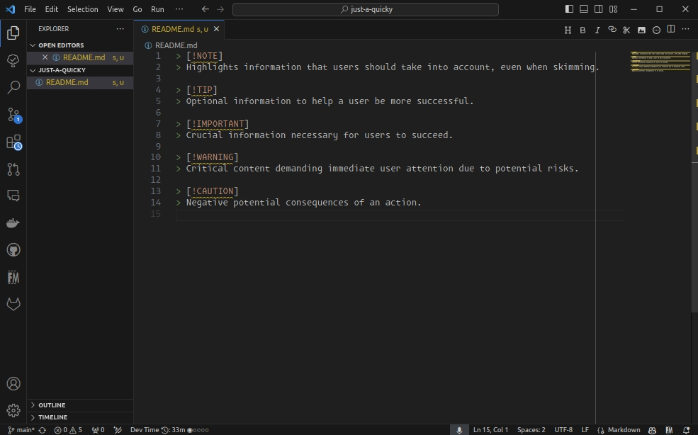
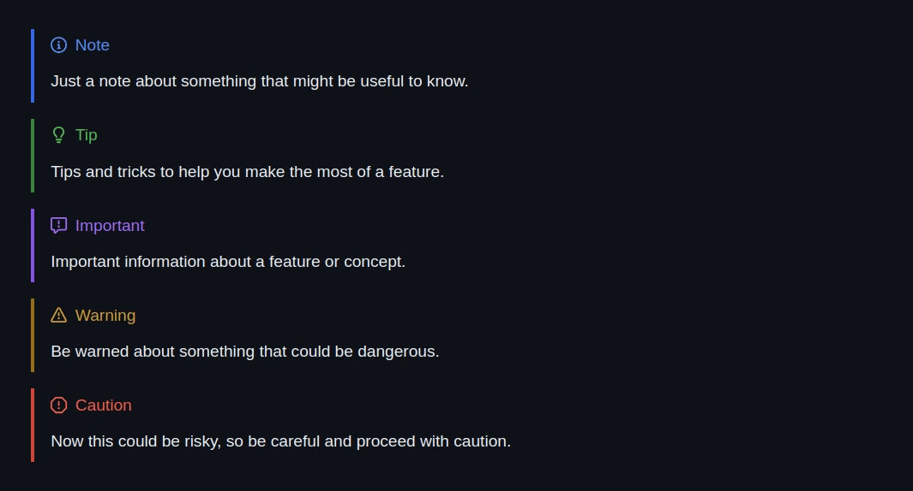

GitHub recently introduced an innovative feature for Markdown documents that allows users to highlight "Note", "Warning", and other notification blocks more effectively. This enhancement is especially useful for developers who want to draw attention to important information within their documentation or discussions.

GitHub Markdown is GitHub's extension to the standard Markdown specification. It's specially designed for use within GitHub's platform and may not be supported in Markdown renderers outside of GitHub.

This new feature helps you to enhance documentation, issues, and discussions with visually distinct alerts, improving readability and emphasis on critical information. Everywhere Markdown works on GitHub.com you can apply these.

Introduced were 5 markers to denote different types of informational blocks:

* `[!NOTE]` for general notes
* `[!TIP]` for tips or advice
* `[!IMPORTANT]` for crucial information
* `[!WARNING]` for warnings
* `[!CAUTION]` for cautionary advice

When used in any Markdown context on GitHub, these markers are automatically styled with distinct colors and icons, making them stand out from the rest of the text.

Here's how you can use these markers in your Markdown documents:

```markdown
> [!NOTE]
> Just a note about something that might be useful to know.

> [!TIP]
> Tips and tricks to help you make the most of a feature.

> [!IMPORTANT]
> Important information about a feature or concept.

> [!WARNING]
> Be warned about something that could be dangerous.

> [!CAUTION]
> Now this could be risky, so be careful and proceed with caution.
```



These blocks automatically render with an icon and background color corresponding to their type, enhancing the visual hierarchy of the document and making critical information immediately apparent. The following is the current rendering on GitHub.com:



For more detailed information on this feature visit the [official discussion on GitHub](https://github.com/orgs/community/discussions/16925).
