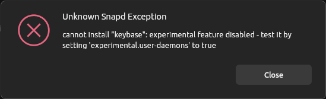

Trying to install Keybase "the normal way" on Ubuntu leads to errors about missing packages. Trying then to run `apt install -f` to fix the issues will lead to Keybase being uninstalled again. In older releases this worked. Now it doesn't.

```bash
❯ sudo dpkg -i Downloads/keybase_amd64.deb
[sudo] password for patrick:
Selecting previously unselected package keybase.
(Reading database … 224676 files and directories currently installed.)
Preparing to unpack Downloads/keybase_amd64.deb …
Unpacking keybase (6.2.8-20240306193933.e38523abbe) …
dpkg: dependency problems prevent configuration of keybase:
 keybase depends on libappindicator1 | libayatana-appindicator1; however:
  Package libappindicator1 is not installed.
  Package libayatana-appindicator1 is not installed.
 keybase depends on libgconf-2-4; however:
  Package libgconf-2-4 is not installed.

dpkg: error processing package keybase (--install):
 dependency problems - leaving unconfigured
Processing triggers for gnome-menus (3.36.0-1.1ubuntu3) …
Processing triggers for desktop-file-utils (0.27-2build1) …
Processing triggers for hicolor-icon-theme (0.17-2) …
Processing triggers for shared-mime-info (2.4-4) …
Errors were encountered while processing:
 keybase

❯ sudo apt --fix-broken install
Reading package lists… Done
Building dependency tree… Done
Reading state information… Done
Correcting dependencies… Done
The following packages will be REMOVED:
  keybase
0 upgraded, 0 newly installed, 1 to remove and 0 not upgraded.
1 not fully installed or removed.
After this operation, 456 MB disk space will be freed.
Do you want to continue? [Y/n]
```

Having Keybase installed, without "fixing" the issue will be leaving you with a working Keybase, but any subsequent installation or update via `apt` will fail with the note to run `--fix-broken`, which will then remove Keybase again.

My first attempts were to install those missing packages. On one side they turned out to being installed. On the other side installing for instance `libgconf` manually did not lead to anything.

After a while I found, that there is a Snap package for Keybase. Trying to install though did not work either:

> cannot install "keybase": experimental feature disabled - test it by setting `experimental.user-daemons` to true.



Well, I did that.

```bash
snap set system experimental.user-daemons=true
```

And finally Keybase was installable.

```bash
sudo snap install keybase
```

And then I read the notice on the snap page:

> NOTE: The keybase snap has a number of limitations due to the nature of the snap sandbox. In particular the git integration is not currently working and whilst it is possible to view files within keybase itself it is not possible to download them or upload them directly. Otherwise it should be quite functional.

Well… can't have everything :( On the other side, encrypted Git repositories are one of the main reasons for me to use Keybase, so this won't be the last time me and Keybase are squaring up.
