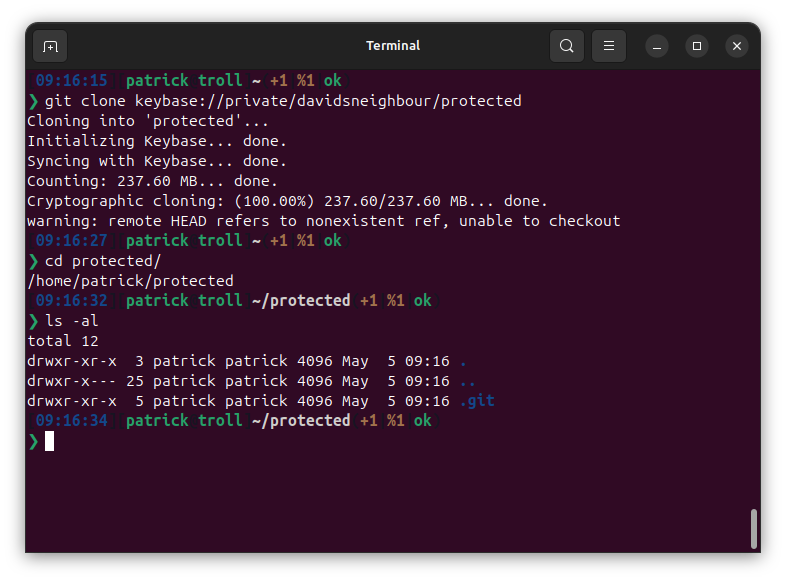
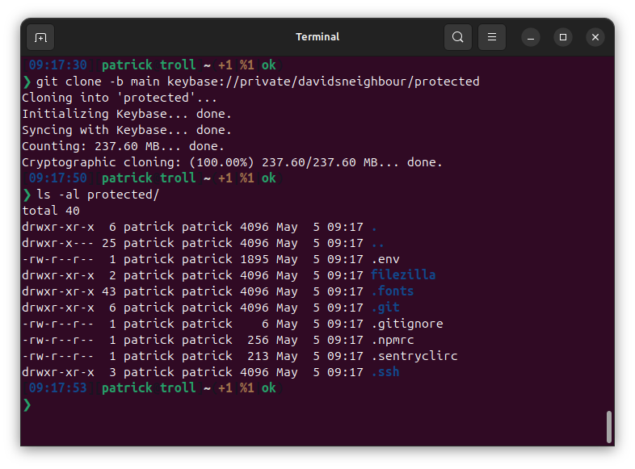

A while back I wrote a post about [how I am saving my protected dotfiles in a Keybase-hosted Git repository](/blog/2022/protected-dotfiles-with-keybase/) and some days back I wrote about how I upgraded to Ubuntu 24.04, the second it came out and [Keybase was uninstallable](/blog/2024/installing-keybase-on-ubuntu-2404/). Well. Turns out Keybase will be topic of this post again, followed by one final swansong post about sunsetting my Keybase use. After that we will not speak of it anymore, promised ;)

After I installed the new Ubuntu, I set up my dotfiles and followed my own instructions to add the encrypted files from Keybase. Looking into the folder my heart stopped for some seconds: The folder was empty. After trying again to check out the files, I saw a warning note at the end of the process:



> warning: remote HEAD refers to nonexistent ref, unable to checkout

The repository I was left with was unusable. I remembered that a while back I could extract the files with a direct checkout of a commit, then make that commit a usable branch and then move branches around to get this into my `main` branch. That all didn't work this day, because the checked out repo was unusable.

But, the solution is astonishingly easy: check out the branch you created directly:

```bash
git clone -b main keybase://private/davidsneighbour/protected
```



It turned out that Keybase has a problem with `main` branches or any other main branch than `master` in a Git repository. There are [plenty of open issue reports](https://github.com/keybase/client/issues/24452) in the more or less dead Keybase repository, [one even nearly 4 years old](https://github.com/keybase/keybase-issues/issues/3909) and nobody really expects Keybase to fix this.

If you keep using Keybase to store encrypted files, then don't change the branch that is created when the repository is created.

Long story short: I got my protected files back, and won't be using Keybase anymore to secure them. There are other ways to store encrypted files in a repository.
