A while back I had an (admittedly frivolous) late night session with an image generating LLM. Don't you dare to judge me, you probably've done it yourself. I was playing around with some imaging models and tried to be clever and create a "scene like in an Wes Anderson movie".

It was back at those times when "real people" generated by AI had multiple extremities and so it was no big surprise that the resulting image contained a couple of faces in places I would not have necessarily expected them. Nonetheless I love the image and it was the perfect fit for the site title since then.

The site header on this site does something I wanted to document while the thinking behind it is still fresh. When you hover over the KOLLITSCH.dev\* title, an image that was visible only through the character outlines grows outward to fill the entire header. The characters themselves morph through the brand colour before dissolving into the image.


No JavaScript. No canvas. No pre-rendered frames. The whole effect runs in CSS, respects `prefers-reduced-motion`, and does not fire on touch devices.

This post is a complete walkthrough of how it works and where every number came from.

## The two states

### Default

The image is visible only through the glyph shapes of the title text. Every character acts as a window into the same photograph. The rest of the header is the normal background colour. This is the `background-clip: text` technique, the photograph is the background of a `<span>`, but the browser clips that background so only the parts underneath actual text pixels are painted.

### Hover

Three things happen simultaneously:

1. A full-bleed copy of the same image expands outward from the text region to cover the entire header.
2. The text characters cycle through a three-stop colour animation: transparent image-fill → solid orange → gray.
3. The link fades out, so the greying characters dissolve into the expanding image.

On mouse-out, everything reverses: the image contracts, the colour transitions back to transparent, and the full opacity returns.

## Animation timeline

```mermaid
gantt
    title Hover-in phases (all values in ms)
    dateFormat  x
    axisFormat  %L ms
    section Image layer
    clip-path expands (inset → 0%)             :0, 700
    opacity fades in                            :100, 450
    section Text colour (three-stop keyframe)
    transparent → orange                        :0, 360
    orange → gray                               :360, 900
    section Text opacity
    fades out                                   :200, 700
```



Three things overlap deliberately:

* The image starts expanding immediately, so the full-bleed image is already growing while the text is still readable.
* The text colour moves through orange first (the brand colour), giving the characters a brief vivid state before they cool into gray.
* The text starts to fade out at 200 ms, so by the time the colour reaches gray at ~900 ms, the opacity has already carried the characters most of the way to invisible. The gray phase is subtle, a cooler tone that eases the transition rather than a hard cut to nothing.

On hover-out the `@keyframes` animation is removed, and a `transition: color 0.4s ease` on the element carries the colour back from whatever gray it reached to transparent. The image contracts and fades simultaneously.

## The components involved

Two files do all the work:

* `src/components/ui/TextImageFill.astro` - a general-purpose component that applies the `background-clip: text` image fill to any inline element.
* `src/components/layout/header/title/SiteTitle.astro` - the site title header, which layers the hover animation on top of the component above.

## How `TextImageFill` works

`TextImageFill` takes an image URL, optional tint, font size, and a fallback colour. It renders any allowed HTML tag with a background image clipped to the text:

```astro
<TextImageFill
  as="span"
  imageUrl="/headline.jpg"
  size="clamp(50px, 13vw, 250px)"
  classes="font-title leading-none"
  fallbackColor="var(--color-orange-500)"
  tintColor="var(--color-red-800)"
  tintOpacity={0.1}
  backgroundSize="100vw auto"
>
  KOLLITSCH.dev*
</TextImageFill>
```

The component exposes all parameters as CSS custom properties and sets `background-clip: text` inside a `@supports` block:

```css
.text-image-fill {
  color: var(--text-fill-fallback);
  background-attachment: var(--text-fill-attachment, scroll);
  background-image:
    linear-gradient(
      rgb(from var(--text-fill-tint-color, transparent) r g b / var(--text-fill-tint-opacity, 0)),
      rgb(from var(--text-fill-tint-color, transparent) r g b / var(--text-fill-tint-opacity, 0))
    ),
    var(--text-fill-image);
  background-position: var(--text-fill-position, center);
  background-repeat: no-repeat;
  background-size: var(--text-fill-size, cover);
  -webkit-background-clip: text;
  background-clip: text;
}

@supports ((-webkit-background-clip: text) or (background-clip: text)) {
  .text-image-fill {
    color: var(--text-fill-active-color, transparent);
  }
}
```

The `@supports` block sets `color: transparent` when the browser supports the property, making the background image visible through the characters. In non-supporting browsers the fallback colour (`var(--color-orange-500)`) is used instead.

The `--text-fill-active-color` custom property is the hook used by the colour morph animation. Its default is `transparent`, preserving the image-through-text look at rest.

## The alignment problem

The obvious first attempt at the hover animation is to add a `::after` pseudo-element on the header with the same image at `background-size: cover`, then expand it with `clip-path` on hover. The problem: `background-size: cover` scales an image to cover its **own element**. The `<span>` containing the text is much smaller than the full-width header, so the same image appears at two completely different zoom levels. There is a visible jump as the expanding `::after` image appears.

### Why `background-attachment: fixed` does not help

The instinctive fix is `background-attachment: fixed`, which makes both elements reference the viewport instead of their own box. Both at `cover` would then scale to the same viewport size, and the images would align.

It does not work here. The `.site-title-hero` header element has a scroll-driven animation:

```css
.site-title-hero {
  animation: site-title-exit linear both;
  animation-timeline: view();
  animation-range: exit 0% exit 100%;
}
```

Any element with an active `animation-timeline` establishes a new stacking context. A stacking context silently breaks `background-attachment: fixed` on descendant elements—they fall back to `scroll` behaviour without warning.

### The actual fix: `background-size: 100vw auto`

Instead of scaling to cover the element, both elements scale the image to cover the **viewport width**:

```css
background-size: 100vw auto;
background-position: center;
```

The maths work out because the title text is horizontally centred in the full-width header:

* The `::after` is `position: absolute; inset: 0`—it fills the header exactly (same width as the viewport).
* `background-position: center` on the header-width element → image left edge is at viewport x = 0.
* The text `<span>` is centred in the viewport. `background-position: center` on a 900 px span inside a 1280 px viewport offsets the 1280 px background image by `(900 − 1280) / 2 = −190 px` relative to the span. The span's own left edge is at x = 190 px. So the image left edge is at viewport x = 190 − 190 = **0 px**—the same as for the header.

Vertically, a centred child span and the full-height `::after` both resolve `background-position: center` to the same image-top-in-viewport coordinate. The images are pixel-matched without any attachment tricks.

## Growing the image: `clip-path` expansion

The full-bleed image lives in a `::after` pseudo-element. At rest it is invisible. On hover, a CSS `clip-path: inset()` expands from the text region to the full header:

```css
/* Default (hover-out) — fast reverse */
.site-title-hero::after {
  background-image: url("/headline.jpg");
  background-position: center;
  background-repeat: no-repeat;
  background-size: 100vw auto;
  clip-path: inset(22% 8% round 48px);   /* ← tight around the text area */
  content: "";
  inset: 0;
  opacity: 0%;
  pointer-events: none;
  position: absolute;
  transition:
    clip-path 0.4s ease,
    opacity 0.3s ease;
  z-index: 0;
}

/* Hover-in — slower, eased expansion */
.site-title-hero:hover::after {
  clip-path: inset(0% round 0);   /* ← full header */
  opacity: 100%;
  transition:
    clip-path 0.7s cubic-bezier(0.25, 0.46, 0.45, 0.94),
    opacity 0.35s ease 0.1s;
}
```

The `clip-path: inset()` takes top/bottom and left/right percentages. `inset(22% 8%)` clips 22 % from top and bottom (the padding above and below the text), and 8 % from each side. This is an approximation—it does not follow the exact glyph outlines—but the effect is convincing because the image behind the text is identical to the expanding image, so the visual transition appears seamless.

The `clip-path` property is animatable by the CSS specification. The browser interpolates between the two `inset()` values, creating the expansion.

### CSS transition asymmetry

Separate `transition` declarations are used on the default state and the `:hover` state. The CSS specification defines that the transition property on the `:hover` state governs the transition **into** that state, while the transition property on the base state governs the transition **out of** it. This gives asymmetric timing:

* Hover-in: 0.7 s cubic-bezier expansion (smooth and unhurried)
* Hover-out: 0.4 s ease contraction (snappy, feels responsive)

## The colour morph: three-stop `@keyframes`

The text colour needs to pass through three stops: transparent (image visible), orange (brand colour), gray (cool fade). A CSS `transition` can only interpolate between two values. A `@keyframes` animation handles multiple stops:

```css
@keyframes text-colour-morph {
  0% {
    color: transparent;
  }

  40% {
    color: var(--color-orange-500);
  }

  100% {
    color: var(--color-gray-400);
  }
}
```

This animation is triggered by the hover state:

```css
/* stylelint-disable-next-line selector-pseudo-class-no-unknown */
.site-title-hero:hover .site-title-link :global(.text-image-fill) {
  animation: text-colour-morph 0.9s ease forwards;
}
```

The `:global()` wrapper is Astro-specific syntax that escapes the component's scoped style boundary so the rule reaches the child component's element. The `stylelint-disable-next-line` comment suppresses the linter warning about an unknown pseudo-class, since generic CSS linters do not understand Astro syntax.

`forwards` fill means the animation freezes at its final keyframe (gray) after it completes. On mouse-out, the animation is removed, and the element's base `transition: color 0.4s ease` carries the colour smoothly from gray back to transparent:

```css
/* stylelint-disable-next-line selector-pseudo-class-no-unknown */
.site-title-link :global(.text-image-fill) {
  transition: color 0.4s ease;
}
```

CSS animations take priority over transitions on the same property. During the hover-in animation, the transition is inactive. When the animation is removed on mouse-out, the transition takes over for the return journey.

### Why `@keyframes` rather than a transition

An earlier version set `--text-fill-active-color: var(--color-orange-500)` on the parent on hover, and the child read it through CSS custom property inheritance. That single-stop approach works for one colour but cannot produce the orange-then-gray sequence without registered `@property` declarations. `@keyframes` is cleaner for multi-stop colour sequences.

## Accessibility

### Touch devices

The entire hover animation is gated behind `@media (hover: hover)`. On touch screens there is no hover event, and `background-attachment: fixed`—which was an earlier iteration of this effect—has known rendering bugs on iOS Safari. Gating on `(hover: hover)` prevents both problems with a single rule.

```css
@media (hover: hover) {
  /* all ::after and hover styles */
}
```

### `prefers-reduced-motion`

All transitions and animations are disabled when the user has requested reduced motion:

```css
@media (prefers-reduced-motion: reduce) {
  .site-title-hero {
    animation: none;
  }

  .site-title-hero::after,
  .site-title-link {
    transition: none;
  }

  /* stylelint-disable-next-line selector-pseudo-class-no-unknown */
  .site-title-hero .site-title-link :global(.text-image-fill) {
    animation: none;
    transition: none;
  }
}
```

The scroll-exit animation on the header (which fades it out as the user scrolls) is also disabled here.

## What to change

### Timing

All durations live in `SiteTitle.astro` inside the `@media (hover: hover)` block.

| Effect | Property | Location | Default |
| --- | --- | --- | --- |
| Image expands | `clip-path` transition (hover-in) | `.site-title-hero:hover::after` | `0.7s cubic-bezier(...)` |
| Image contracts | `clip-path` transition (hover-out) | `.site-title-hero::after` | `0.4s ease` |
| Image fades in | `opacity` transition (hover-in) | `.site-title-hero:hover::after` | `0.35s ease 0.1s` |
| Image fades out | `opacity` transition (hover-out) | `.site-title-hero::after` | `0.3s ease` |
| Colour morph (hover-in) | `animation` duration | `@keyframes text-colour-morph` call | `0.9s ease` |
| Colour reverse (hover-out) | `color` transition | `.site-title-link :global(.text-image-fill)` | `0.4s ease` |
| Text fade-out | `opacity` transition (hover-in) | `.site-title-hero:hover .site-title-link` | `0.5s ease 0.2s` |
| Text fade-in | `opacity` transition (hover-out) | `.site-title-link` | `0.4s ease` |

### The starting clip region

`clip-path: inset(22% 8% round 48px)` determines where the expanding image starts. Increase the first value (vertical) to start with a tighter vertical clip; increase the second (horizontal) to start with a narrower horizontal clip. The values are percentages of the `::after` element's own dimensions.

```css
/* tighter starting region — more dramatic expansion */
clip-path: inset(30% 15% round 48px);

/* looser starting region — subtler expansion */
clip-path: inset(15% 4% round 48px);
```

### The morph colours

Change the keyframe stops to use different colours or add more stops:

```css
@keyframes text-colour-morph {
  0%   { color: transparent; }
  40%  { color: var(--color-orange-500); }  /* brand colour */
  100% { color: var(--color-gray-400); }    /* cool exit */
}
```

Any valid CSS colour works, including colours with transparency. Using `oklch(75% 0.18 50 / 70%)` for example gives a partially translucent morph where the image still bleeds through the characters at peak orange.

### The image

The image path is set in two places in `SiteTitle.astro` and must be kept in sync:

```astro
<TextImageFill imageUrl="/headline.jpg" ...>
```

```css
.site-title-hero::after {
  background-image: url("/headline.jpg");
}
```

For the alignment trick to hold, both must reference the same image at the same background position. If you change the image, change both.

## The complete `SiteTitle.astro`

```astro
---
import TextImageFill from "@components/ui/TextImageFill.astro";
import setup from "@data/setup.json" with { type: "json" };
import { getHomepageUrl } from "@utils/content.ts";

export interface Props {
  siteTitleId: string;
}

const homepageUrl = getHomepageUrl();
const { siteTitleId }: Props = Astro.props;
const siteTitleSize = "clamp(50px, 13vw, 250px)";
---

<header aria-label="Site title" id={siteTitleId} class="site-title-hero w-full py-6 text-center md:py-10">
  <a href={homepageUrl} class="site-title-link inline-block">
    <TextImageFill
      as="span"
      imageUrl="/headline.jpg"
      size={siteTitleSize}
      classes="font-title leading-none"
      fallbackColor="var(--color-orange-500)"
      tintColor="var(--color-red-800)"
      tintOpacity={0.1}
      backgroundSize="100vw auto"
    >
      {setup.title}
    </TextImageFill>
  </a>
</header>

<style>
  .site-title-hero {
    overflow: hidden;
    position: relative;
    animation: site-title-exit linear both;
    animation-timeline: view();
    animation-range: exit 0% exit 100%;
  }

  .site-title-link {
    position: relative;
    z-index: 1;
  }

  @keyframes text-colour-morph {
    0% {
      color: transparent;
    }

    40% {
      color: var(--color-orange-500);
    }

    100% {
      color: var(--color-gray-400);
    }
  }

  @media (hover: hover) {
    .site-title-hero::after {
      background-image: url("/headline.jpg");
      background-position: center;
      background-repeat: no-repeat;
      background-size: 100vw auto;
      clip-path: inset(22% 8% round 48px);
      content: "";
      inset: 0;
      opacity: 0%;
      pointer-events: none;
      position: absolute;
      transition:
        clip-path 0.4s ease,
        opacity 0.3s ease;
      z-index: 0;
    }

    .site-title-hero:hover::after {
      clip-path: inset(0% round 0);
      opacity: 100%;
      transition:
        clip-path 0.7s cubic-bezier(0.25, 0.46, 0.45, 0.94),
        opacity 0.35s ease 0.1s;
    }

    /* On hover-out, transition from gray back to transparent */
    /* stylelint-disable-next-line selector-pseudo-class-no-unknown */
    .site-title-link :global(.text-image-fill) {
      transition: color 0.4s ease;
    }

    /* On hover-in, run the three-stop colour animation */
    /* stylelint-disable-next-line selector-pseudo-class-no-unknown */
    .site-title-hero:hover .site-title-link :global(.text-image-fill) {
      animation: text-colour-morph 0.9s ease forwards;
    }

    .site-title-link {
      transition: opacity 0.4s ease;
    }

    .site-title-hero:hover .site-title-link {
      opacity: 0%;
      transition: opacity 0.5s ease 0.2s;
    }
  }

  @keyframes site-title-exit {
    from {
      opacity: 100%;
      transform: none;
    }

    to {
      opacity: 0%;
      transform: translateY(-12px) scale(0.98);
    }
  }

  @media (prefers-reduced-motion: reduce) {
    .site-title-hero {
      animation: none;
    }

    .site-title-hero::after,
    .site-title-link {
      transition: none;
    }

    /* stylelint-disable-next-line selector-pseudo-class-no-unknown */
    .site-title-hero .site-title-link :global(.text-image-fill) {
      animation: none;
      transition: none;
    }
  }
</style>
```

## Key takeaways

**`background-clip: text` is a display technique, not an animation primitive.** You cannot transition between `background-clip: text` and `background-clip: border-box`. The image can only expand if a second element carries the full-bleed version.

**Alignment requires matching reference frames.** `background-size: cover` is relative to each element individually. For two elements of different sizes to show the same image at the same scale, they need to use the same reference—in this case a fixed absolute width (`100vw`) combined with the mathematical coincidence that centering a child in a full-width parent makes both `background-position: center` calculations resolve to the same origin.

**Multi-stop colour animations need `@keyframes`.** A CSS `transition` only interpolates between two values. For three stops (transparent, orange, gray), use `@keyframes`. The hover-out direction is handled separately by a `transition` that takes over once the animation is removed.

**Scroll-driven animations create stacking contexts.** `animation-timeline: view()` makes an element behave as if it has `will-change: transform`, which breaks `background-attachment: fixed` on descendants. Always verify that browser features you rely on still work inside animated ancestors.
