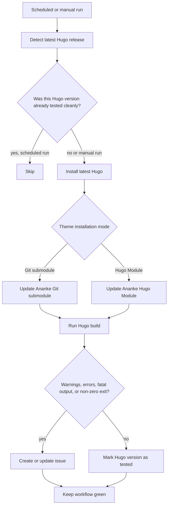
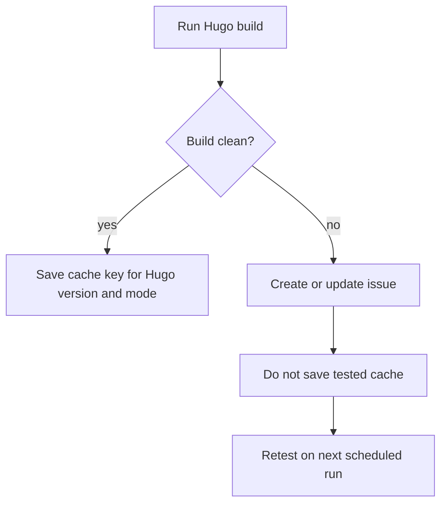

Ananke is used in two common ways:

1. as a Git submodule in `themes/ananke`
2. as a Hugo Module in `go.mod`

Both approaches are valid, but they have different failure modes. A Git submodule can point at the wrong branch. A Hugo Module can resolve to an unexpected version. A template repository can build fine today and then fail tomorrow because Hugo changed something in a new release.

This workflow exists to catch that early.

It does not deploy anything. It does not publish anything. It does not try to fix the template repository. It checks the latest Hugo release, updates the theme source for the installation method used by the repository, runs `hugo`, and reports build problems into the main Ananke issue tracker.

There are two separate workflows:

* Git submodule workflow:
  `template-git-submod/.github/workflows/hugo-release-check.yaml`
* Hugo Module workflow:
  `template-hugo-mod/.github/workflows/hugo-release-check.yaml`

They are intentionally separate. This is not duplication for the sake of duplication. It keeps the two supported installation methods honest.

A Git submodule build should test the Git submodule path.

A Hugo Module build should test the Hugo Module path.

Mixing both in one workflow would make the result less useful, because a failure would not clearly say which integration method broke.

## The problem this solves

The normal release process usually answers this question:

> Does the project build with the version of Hugo we currently use?

This workflow answers a different question:

> Does the project still build with the latest Hugo release?

That distinction matters.

If the latest Hugo release introduces a warning, changes module handling, changes template behaviour, or breaks an assumption in Ananke, we want to know before users run into it.

The workflow is therefore a watchdog, not a CI gate.

That is the most important design decision in the whole setup.

## Green does not always mean "Hugo built successfully"

A normal CI workflow often treats a build failure as a workflow failure. This workflow does not.

Here, a Hugo build failure is useful information. If the workflow can capture that failure and report it as an issue, then the workflow did its job.

That gives us this model:

```text
green = watchdog completed its reporting job
red   = watchdog itself is broken
cache = this Hugo version was proven clean for this installation method
```

That is deliberately different from a deployment workflow.

If `hugo` emits warnings or exits with an error, the workflow creates or updates an issue and still stays green. If the workflow cannot install Hugo, cannot update the module or submodule, cannot write the build log, or cannot create the issue, then the workflow turns red.

## Overview

The workflows follow the same high-level structure.



The cache is only saved after a clean build. If a Hugo version produces a warning or failure, it is not marked as tested. The next scheduled run will test it again and update the same issue.

That is useful because a problem may be fixed by a change in the template repository or the theme without requiring a new Hugo release.

## Stable references

The links below use commit-pinned GitHub URLs. They do not point at `main`, because `main` moves.

* Git submodule workflow:
  `https://github.com/gohugo-ananke/template-git-submod/blob/ddb03dab7eccc61d8e1f18aa6cda09b792878989/.github/workflows/hugo-release-check.yaml`
* Hugo Module workflow:
  `https://github.com/gohugo-ananke/template-hugo-mod/blob/b54f1bb4cb986c729ea3e298f7472e712d882bd8/.github/workflows/hugo-release-check.yaml`

When the workflow changes substantially, update these links to the new commit hash.

## Triggering the workflow

Both workflows run once per day and can also be triggered manually.

Git submodule version:

[Git submodule workflow trigger](https://github.com/gohugo-ananke/template-git-submod/blob/ddb03dab7eccc61d8e1f18aa6cda09b792878989/.github/workflows/hugo-release-check.yaml#L9-L13)

```yaml
on:
  workflow_dispatch:
  schedule:
    # Daily at 03:20 UTC / 10:20 UTC+7.
    - cron: "20 3 * * *"
```

Hugo Module version:

[Hugo Module workflow trigger](https://github.com/gohugo-ananke/template-hugo-mod/blob/b54f1bb4cb986c729ea3e298f7472e712d882bd8/.github/workflows/hugo-release-check.yaml#L9-L13)

```yaml
on:
  workflow_dispatch:
  schedule:
    # Daily at 03:20 UTC / 10:20 UTC+7.
    - cron: "20 3 * * *"
```

The daily schedule is enough because Hugo releases do not need minute-level monitoring here. The workflow checks whether the latest Hugo version is new, and only performs the expensive part when needed.

Manual runs are different. A manual run always performs the check, even if the latest Hugo version has already been marked as tested. That is useful when the template repository, Ananke, or the workflow itself changed.

## Permissions

Both workflows use minimal default permissions.

[Git submodule workflow permissions](https://github.com/gohugo-ananke/template-git-submod/blob/ddb03dab7eccc61d8e1f18aa6cda09b792878989/.github/workflows/hugo-release-check.yaml#L15-L16)

```yaml
permissions:
  contents: read
```

[Hugo Module workflow permissions](https://github.com/gohugo-ananke/template-hugo-mod/blob/b54f1bb4cb986c729ea3e298f7472e712d882bd8/.github/workflows/hugo-release-check.yaml#L15-L16)

```yaml
permissions:
  contents: read
```

The workflow does not use the repository token to write to the current repository. It only needs read access to the current repository contents.

Issue creation happens in another repository, so it uses a dedicated secret token instead of relying on `GITHUB_TOKEN`.

## Concurrency

The workflows use a fixed concurrency group per installation mode.

Git submodule version:

[Git submodule workflow concurrency](https://github.com/gohugo-ananke/template-git-submod/blob/ddb03dab7eccc61d8e1f18aa6cda09b792878989/.github/workflows/hugo-release-check.yaml#L18-L21)

```yaml
concurrency:
  group: hugo-latest-build-watch-submodule
  cancel-in-progress: false
```

Hugo Module version:

[Hugo Module workflow concurrency](https://github.com/gohugo-ananke/template-hugo-mod/blob/b54f1bb4cb986c729ea3e298f7472e712d882bd8/.github/workflows/hugo-release-check.yaml#L18-L21)

```yaml
concurrency:
  group: hugo-latest-build-watch-module
  cancel-in-progress: false
```

The group names are intentionally different. The Git submodule workflow and the Hugo Module workflow should not cancel each other.

`cancel-in-progress: false` means a running check is allowed to finish. That matters because the result may create or update an issue, and cancelling halfway through would produce noise without a useful report.

## Configuration

The main configuration is in the workflow-level `env` block.

### Shared settings

The shared settings configure where issues are created, which labels are attached, who is assigned, whether Hugo Extended is used, and which build command is executed.

Git submodule version:

[Git submodule workflow shared environment](https://github.com/gohugo-ananke/template-git-submod/blob/ddb03dab7eccc61d8e1f18aa6cda09b792878989/.github/workflows/hugo-release-check.yaml#L23-L31)

```yaml
env:
  TARGET_ISSUE_REPOSITORY: gohugo-ananke/ananke
  ISSUE_LABELS: status:blocked,prio:critical
  ISSUE_ASSIGNEES: davidsneighbour

  HUGO_EXTENDED: "false"
  HUGO_BUILD_COMMAND: hugo --printI18nWarnings --printPathWarnings --printUnusedTemplates
```

Hugo Module version:

[Hugo Module workflow shared environment](https://github.com/gohugo-ananke/template-hugo-mod/blob/b54f1bb4cb986c729ea3e298f7472e712d882bd8/.github/workflows/hugo-release-check.yaml#L23-L31)

```yaml
env:
  TARGET_ISSUE_REPOSITORY: gohugo-ananke/ananke
  ISSUE_LABELS: status:blocked,prio:critical
  ISSUE_ASSIGNEES: davidsneighbour

  HUGO_EXTENDED: "false"
  HUGO_BUILD_COMMAND: hugo --printI18nWarnings --printPathWarnings --printUnusedTemplates
```

`TARGET_ISSUE_REPOSITORY` is where compatibility issues are reported. In this setup the workflows run in template repositories, but the issue should be created in `gohugo-ananke/ananke`.

`ISSUE_LABELS` is a comma-separated list of labels. The current defaults are:

```yaml
ISSUE_LABELS: status:blocked,prio:critical
```

`ISSUE_ASSIGNEES` is also configurable. Use GitHub usernames without `@`:

```yaml
ISSUE_ASSIGNEES: davidsneighbour
```

Multiple assignees are supported:

```yaml
ISSUE_ASSIGNEES: davidsneighbour,another-user
```

`HUGO_EXTENDED` controls which Hugo release asset is downloaded. Keep it as `"false"` unless the tested site needs Hugo Extended.

`HUGO_BUILD_COMMAND` is the command that is executed after the theme source has been updated. The current command enables useful Hugo warnings:

```yaml
HUGO_BUILD_COMMAND: hugo --printI18nWarnings --printPathWarnings --printUnusedTemplates
```

This is deliberately stricter than a plain `hugo` command. The point is not only to catch hard failures. The point is to catch warnings too.

### Git submodule specific settings

The Git submodule workflow adds two settings:

[Git submodule workflow submodule settings](https://github.com/gohugo-ananke/template-git-submod/blob/ddb03dab7eccc61d8e1f18aa6cda09b792878989/.github/workflows/hugo-release-check.yaml#L31-L34)

```yaml
  ANANKE_SUBMODULE_PATH: themes/ananke
  ANANKE_EXPECTED_BRANCH: main
```

`ANANKE_SUBMODULE_PATH` tells the workflow where the theme submodule is expected to live.

`ANANKE_EXPECTED_BRANCH` tells the workflow which branch should be configured in `.gitmodules`.

The workflow does not fail if the branch is different or missing. It emits a warning. That is intentional. A branch mismatch is a configuration smell, not necessarily a broken build.

The `.gitmodules` file should contain something like this:

```ini
[submodule "themes/ananke"]
 path = themes/ananke
 url = https://github.com/gohugo-ananke/ananke.git
 branch = main
```

The important line is:

```ini
 branch = main
```

Without it, `git submodule update --remote` may not test the branch you think it tests.

### Hugo Module specific settings

The Hugo Module workflow adds two module settings:

[Hugo Module workflow module settings](https://github.com/gohugo-ananke/template-hugo-mod/blob/b54f1bb4cb986c729ea3e298f7472e712d882bd8/.github/workflows/hugo-release-check.yaml#L31-L34)

```yaml
  ANANKE_MODULE_PATH: github.com/gohugo-ananke/ananke/v2
  ANANKE_MODULE_VERSION: latest
```

`ANANKE_MODULE_PATH` is the module path expected in `go.mod`.

The current Ananke module path is:

```text
github.com/gohugo-ananke/ananke/v2
```

The `v2` suffix matters because Go Modules require the major version suffix for v2 and later.

`ANANKE_MODULE_VERSION` controls what the workflow asks Hugo to resolve. The default is:

```yaml
ANANKE_MODULE_VERSION: latest
```

That means the workflow tests the current latest published module version. You can change this to a branch, tag, pseudo-version, or commit reference if you need a different policy.

For example:

```yaml
ANANKE_MODULE_VERSION: main
```

or:

```yaml
ANANKE_MODULE_VERSION: v2.16.0
```

The template currently has this kind of requirement in `go.mod`:

```go
require github.com/gohugo-ananke/ananke/v2 v2.16.0 // indirect
```

The workflow updates it before building.

## Required secret

The workflows create or update issues in another repository. The default `GITHUB_TOKEN` is not the right tool for that job.

Create this secret in the template repository:

```text
ANANKE_ISSUE_TOKEN
```

Use a fine-grained GitHub token with issue write access to the target repository:

```text
gohugo-ananke/ananke
```

Required permission:

```text
Issues: Read and write
```

The workflow checks for the secret before trying to create an issue.

[Git submodule workflow token check](https://github.com/gohugo-ananke/template-git-submod/blob/ddb03dab7eccc61d8e1f18aa6cda09b792878989/.github/workflows/hugo-release-check.yaml#L320-L325)

```bash
set -Eeuo pipefail

if [[ -z "${GH_TOKEN:-}" ]]; then
  echo "::error::Missing secret ANANKE_ISSUE_TOKEN. This must be a fine-grained token with issue write access to ${TARGET_ISSUE_REPOSITORY}."
  exit 1
fi
```

[Hugo Module workflow token check](https://github.com/gohugo-ananke/template-hugo-mod/blob/b54f1bb4cb986c729ea3e298f7472e712d882bd8/.github/workflows/hugo-release-check.yaml#L311-L316)

```bash
set -Eeuo pipefail

if [[ -z "${GH_TOKEN:-}" ]]; then
  echo "::error::Missing secret ANANKE_ISSUE_TOKEN. This must be a fine-grained token with issue write access to ${TARGET_ISSUE_REPOSITORY}."
  exit 1
fi
```

If this token is missing, the workflow should fail. It cannot do its job without being able to report the problem.

## Checkout and security

Both workflows use `actions/checkout`, pinned by full commit hash.

Git submodule version:

[Git submodule workflow checkout](https://github.com/gohugo-ananke/template-git-submod/blob/ddb03dab7eccc61d8e1f18aa6cda09b792878989/.github/workflows/hugo-release-check.yaml#L58-L66)

```yaml
      - name: Checkout repository
        uses: actions/checkout@11bd71901bbe5b1630ceea73d27597364c9af683 # v4.2.2
        with:
          fetch-depth: 0
          persist-credentials: false
          submodules: recursive
```

Hugo Module version:

[Hugo Module workflow checkout](https://github.com/gohugo-ananke/template-hugo-mod/blob/b54f1bb4cb986c729ea3e298f7472e712d882bd8/.github/workflows/hugo-release-check.yaml#L56-L63)

```yaml
      - name: Checkout repository
        uses: actions/checkout@11bd71901bbe5b1630ceea73d27597364c9af683 # v4.2.2
        with:
          fetch-depth: 1
          persist-credentials: false
```

There are three things worth pointing out here.

First, the action is pinned by hash, not by tag:

```yaml
uses: actions/checkout@11bd71901bbe5b1630ceea73d27597364c9af683
```

That makes the workflow less dependent on mutable tags.

Second, both workflows use:

```yaml
persist-credentials: false
```

This prevents the checkout action from leaving credentials behind in the local Git configuration. That is a sensible hardening default and avoids warnings from workflow linters such as `zizmor`.

Third, the Git submodule workflow uses:

```yaml
fetch-depth: 0
submodules: recursive
```

The full fetch is safer for submodule operations, especially when the workflow updates a submodule to the latest remote commit. The Hugo Module workflow does not need that, so it keeps `fetch-depth: 1`.

## Finding the latest Hugo release

Both workflows query the GitHub API for the latest Hugo release.

[Git submodule workflow Hugo release detection](https://github.com/gohugo-ananke/template-git-submod/blob/ddb03dab7eccc61d8e1f18aa6cda09b792878989/.github/workflows/hugo-release-check.yaml#L68-L113)

```bash
set -Eeuo pipefail

latest_json="$(gh api repos/gohugoio/hugo/releases/latest)"
version="$(jq -r '.tag_name' <<< "${latest_json}")"

if [[ -z "${version}" || "${version}" == "null" ]]; then
  echo "::error::Could not detect latest Hugo release."
  exit 1
fi
```

[Hugo Module workflow Hugo release detection](https://github.com/gohugo-ananke/template-hugo-mod/blob/b54f1bb4cb986c729ea3e298f7472e712d882bd8/.github/workflows/hugo-release-check.yaml#L65-L110)

```bash
set -Eeuo pipefail

latest_json="$(gh api repos/gohugoio/hugo/releases/latest)"
version="$(jq -r '.tag_name' <<< "${latest_json}")"

if [[ -z "${version}" || "${version}" == "null" ]]; then
  echo "::error::Could not detect latest Hugo release."
  exit 1
fi
```

Then the workflow chooses the correct binary asset.

```bash
arch="linux-amd64"

if [[ "${HUGO_EXTENDED}" == "true" ]]; then
  asset_pattern="hugo_extended_${version#v}_${arch}.tar.gz"
else
  asset_pattern="hugo_${version#v}_${arch}.tar.gz"
fi
```

If the asset cannot be found, the workflow fails. That is not a Hugo compatibility issue. It means the workflow could not prepare the test environment.

The workflow also stores a Hugo release URL:

```bash
release_url="https://github.com/gohugoio/hugo/releases/tag/${version}"
```

That URL is later used in the issue body, so the issue links directly to the relevant Hugo release notes.

## The cache mechanism

The cache answers one question:

> Has this workflow already proven that this Hugo version builds cleanly for this installation method?

The cache key is intentionally different for the two workflows.

Git submodule version:

[Git submodule workflow cache key](https://github.com/gohugo-ananke/template-git-submod/blob/ddb03dab7eccc61d8e1f18aa6cda09b792878989/.github/workflows/hugo-release-check.yaml#L104-L109)

```bash
{
  echo "version=${version}"
  echo "asset_url=${asset_url}"
  echo "release_url=${release_url}"
  echo "cache_key=hugo-build-tested-submodule-${version}"
} >> "${GITHUB_OUTPUT}"
```

Hugo Module version:

[Hugo Module workflow cache key](https://github.com/gohugo-ananke/template-hugo-mod/blob/b54f1bb4cb986c729ea3e298f7472e712d882bd8/.github/workflows/hugo-release-check.yaml#L101-L106)

```bash
{
  echo "version=${version}"
  echo "asset_url=${asset_url}"
  echo "release_url=${release_url}"
  echo "cache_key=hugo-build-tested-module-${version}"
} >> "${GITHUB_OUTPUT}"
```

This separation matters. A clean Git submodule build does not prove that the Hugo Module build works. A clean Hugo Module build does not prove that the Git submodule build works.

The workflows check the cache with `lookup-only: true`.

Git submodule version:

[Git submodule workflow cache lookup](https://github.com/gohugo-ananke/template-git-submod/blob/ddb03dab7eccc61d8e1f18aa6cda09b792878989/.github/workflows/hugo-release-check.yaml#L119-L126)

```yaml
      - name: Check whether this Hugo version was already tested
        id: tested-cache
        uses: actions/cache@5a3ec84eff668545956fd18022155c47e93e2684 # v4.2.3
        with:
          path: .github/.cache/hugo-latest-build-watch-submodule
          key: ${{ steps.hugo.outputs.cache_key }}
          lookup-only: true
```

Hugo Module version:

[Hugo Module workflow cache lookup](https://github.com/gohugo-ananke/template-hugo-mod/blob/b54f1bb4cb986c729ea3e298f7472e712d882bd8/.github/workflows/hugo-release-check.yaml#L116-L123)

```yaml
      - name: Check whether this Hugo version was already tested
        id: tested-cache
        uses: actions/cache@5a3ec84eff668545956fd18022155c47e93e2684 # v4.2.3
        with:
          path: .github/.cache/hugo-latest-build-watch-module
          key: ${{ steps.hugo.outputs.cache_key }}
          lookup-only: true
```

If the cache exists and the run is scheduled, the workflow skips the build.

[Git submodule workflow skip step](https://github.com/gohugo-ananke/template-git-submod/blob/ddb03dab7eccc61d8e1f18aa6cda09b792878989/.github/workflows/hugo-release-check.yaml#L128-L132)

```yaml
      - name: Skip unchanged Hugo version
        if: steps.tested-cache.outputs.cache-hit == 'true' && github.event_name != 'workflow_dispatch'
        shell: bash
        run: |
          echo "Hugo ${{ steps.hugo.outputs.version }} was already tested successfully for the Git submodule build. Nothing to do."
```

[Hugo Module workflow skip step](https://github.com/gohugo-ananke/template-hugo-mod/blob/b54f1bb4cb986c729ea3e298f7472e712d882bd8/.github/workflows/hugo-release-check.yaml#L125-L129)

```yaml
      - name: Skip unchanged Hugo version
        if: steps.tested-cache.outputs.cache-hit == 'true' && github.event_name != 'workflow_dispatch'
        shell: bash
        run: |
          echo "Hugo ${{ steps.hugo.outputs.version }} was already tested successfully for the Hugo Module build. Nothing to do."
```

Manual runs ignore the cache and execute the full workflow.

The cache is only saved at the very end, and only if the build was clean.

Git submodule version:

[Git submodule workflow tested cache save](https://github.com/gohugo-ananke/template-git-submod/blob/ddb03dab7eccc61d8e1f18aa6cda09b792878989/.github/workflows/hugo-release-check.yaml#L456-L464)

```yaml
      - name: Mark Hugo version as tested
        if: >-
          (steps.tested-cache.outputs.cache-hit != 'true' || github.event_name == 'workflow_dispatch') &&
          steps.build.outputs.has_problems != 'true' &&
          steps.build.outputs.exit_code == '0'
        uses: actions/cache/save@5a3ec84eff668545956fd18022155c47e93e2684 # v4.2.3
        with:
          path: .github/.cache/hugo-latest-build-watch-submodule
          key: ${{ steps.hugo.outputs.cache_key }}
```

Hugo Module version:

[Hugo Module workflow tested cache save](https://github.com/gohugo-ananke/template-hugo-mod/blob/b54f1bb4cb986c729ea3e298f7472e712d882bd8/.github/workflows/hugo-release-check.yaml#L439-L447)

```yaml
      - name: Mark Hugo version as tested
        if: >-
          (steps.tested-cache.outputs.cache-hit != 'true' || github.event_name == 'workflow_dispatch') &&
          steps.build.outputs.has_problems != 'true' &&
          steps.build.outputs.exit_code == '0'
        uses: actions/cache/save@5a3ec84eff668545956fd18022155c47e93e2684 # v4.2.3
        with:
          path: .github/.cache/hugo-latest-build-watch-module
          key: ${{ steps.hugo.outputs.cache_key }}
```

This condition is important:

```yaml
steps.build.outputs.has_problems != 'true' &&
steps.build.outputs.exit_code == '0'
```

It means a Hugo version is only counted as already checked when it built cleanly and emitted no matched warning/error output.

If the build fails, the workflow creates or updates an issue, but it does not save the cache. The same Hugo version will be retested on the next scheduled run.

That is exactly what we want.

## Runtime cache paths

The workflow also configures runtime cache paths for Hugo and Go. These are not the same as the "already checked" GitHub Actions cache.

Git submodule version:

[Git submodule workflow runtime cache paths](https://github.com/gohugo-ananke/template-git-submod/blob/ddb03dab7eccc61d8e1f18aa6cda09b792878989/.github/workflows/hugo-release-check.yaml#L134-L144)

```yaml
      - name: Configure runtime cache paths
        if: steps.tested-cache.outputs.cache-hit != 'true' || github.event_name == 'workflow_dispatch'
        shell: bash
        run: |
          set -Eeuo pipefail

          {
            echo "HUGO_CACHEDIR=${RUNNER_TEMP}/hugo-cache"
            echo "GOPATH=${RUNNER_TEMP}/go"
            echo "GOMODCACHE=${RUNNER_TEMP}/go/pkg/mod"
          } >> "${GITHUB_ENV}"
```

Hugo Module version:

[Hugo Module workflow runtime cache paths](https://github.com/gohugo-ananke/template-hugo-mod/blob/b54f1bb4cb986c729ea3e298f7472e712d882bd8/.github/workflows/hugo-release-check.yaml#L131-L141)

```yaml
      - name: Configure runtime cache paths
        if: steps.tested-cache.outputs.cache-hit != 'true' || github.event_name == 'workflow_dispatch'
        shell: bash
        run: |
          set -Eeuo pipefail

          {
            echo "HUGO_CACHEDIR=${RUNNER_TEMP}/hugo-cache-${GITHUB_RUN_ID}-${GITHUB_RUN_ATTEMPT}"
            echo "GOPATH=${RUNNER_TEMP}/go-${GITHUB_RUN_ID}-${GITHUB_RUN_ATTEMPT}"
            echo "GOMODCACHE=${RUNNER_TEMP}/go-${GITHUB_RUN_ID}-${GITHUB_RUN_ATTEMPT}/pkg/mod"
          } >> "${GITHUB_ENV}"
```

The Hugo Module workflow uses a unique Go module cache per workflow run attempt.

That detail exists because Go can place read-only toolchain files inside its module cache. A raw `rm -rf` of `GOMODCACHE` can fail with permission errors. The fix is simple: do not delete the module cache manually. Use a unique temporary path and let the runner clean it up after the job.

The Git submodule workflow still prepares a fresh cache with `rm -rf`, but it is not doing Hugo Module dependency resolution in the same way. The Hugo Module workflow is the one where the Go toolchain cache issue showed up.

## Installing Hugo

Both workflows download the latest Hugo release asset, unpack it into the runner temp directory, and put it on `PATH`.

Git submodule version:

[Git submodule workflow Hugo installation](https://github.com/gohugo-ananke/template-git-submod/blob/ddb03dab7eccc61d8e1f18aa6cda09b792878989/.github/workflows/hugo-release-check.yaml#L146-L164)

```bash
mkdir -p "${RUNNER_TEMP}/hugo"

curl --fail --location --silent --show-error \
  --output "${RUNNER_TEMP}/hugo/hugo.tar.gz" \
  "${{ steps.hugo.outputs.asset_url }}"

tar -xzf "${RUNNER_TEMP}/hugo/hugo.tar.gz" -C "${RUNNER_TEMP}/hugo"
chmod +x "${RUNNER_TEMP}/hugo/hugo"
```

Hugo Module version:

[Hugo Module workflow Hugo installation](https://github.com/gohugo-ananke/template-hugo-mod/blob/b54f1bb4cb986c729ea3e298f7472e712d882bd8/.github/workflows/hugo-release-check.yaml#L143-L161)

```bash
mkdir -p "${RUNNER_TEMP}/hugo"

curl --fail --location --silent --show-error \
  --output "${RUNNER_TEMP}/hugo/hugo.tar.gz" \
  "${{ steps.hugo.outputs.asset_url }}"

tar -xzf "${RUNNER_TEMP}/hugo/hugo.tar.gz" -C "${RUNNER_TEMP}/hugo"
chmod +x "${RUNNER_TEMP}/hugo/hugo"
```

The workflow does not use an existing Hugo installation from the runner. That would defeat the purpose. The point is to test the latest upstream release.

After installation, both workflows verify that `hugo` is available.

[Git submodule workflow Hugo verification](https://github.com/gohugo-ananke/template-git-submod/blob/ddb03dab7eccc61d8e1f18aa6cda09b792878989/.github/workflows/hugo-release-check.yaml#L166-L177)

```bash
set -Eeuo pipefail

if ! command -v hugo > /dev/null 2>&1; then
  echo "::error::Hugo executable was not found on PATH."
  exit 1
fi

hugo version
```

[Hugo Module workflow Hugo verification](https://github.com/gohugo-ananke/template-hugo-mod/blob/b54f1bb4cb986c729ea3e298f7472e712d882bd8/.github/workflows/hugo-release-check.yaml#L163-L174)

```bash
set -Eeuo pipefail

if ! command -v hugo > /dev/null 2>&1; then
  echo "::error::Hugo executable was not found on PATH."
  exit 1
fi

hugo version
```

If this step fails, the workflow fails. That is a broken test setup, not a reportable Hugo build issue.

## Updating Ananke as a Git submodule

This section applies only to the Git submodule workflow.

The Git submodule workflow validates that it is running in the right kind of repository.

[Git submodule workflow `.gitmodules` validation](https://github.com/gohugo-ananke/template-git-submod/blob/ddb03dab7eccc61d8e1f18aa6cda09b792878989/.github/workflows/hugo-release-check.yaml#L179-L194)

```bash
set -Eeuo pipefail

if [[ ! -f ".gitmodules" ]]; then
  echo "::error::No .gitmodules file found. This workflow is for the Git submodule implementation."
  exit 1
fi

if [[ -z "${ANANKE_SUBMODULE_PATH}" ]]; then
  echo "::error::ANANKE_SUBMODULE_PATH is empty."
  exit 1
fi
```

A missing `.gitmodules` file is a workflow failure. This workflow is specifically for the submodule template. If `.gitmodules` is missing, the repository is not in the expected shape.

Then the workflow finds the submodule entry that points at the configured path.

[Git submodule workflow submodule lookup](https://github.com/gohugo-ananke/template-git-submod/blob/ddb03dab7eccc61d8e1f18aa6cda09b792878989/.github/workflows/hugo-release-check.yaml#L196-L214)

```bash
submodule_name="$(
  git config -f .gitmodules --get-regexp '^submodule\..*\.path$' \
    | awk -v path="${ANANKE_SUBMODULE_PATH}" '
        $2 == path {
          key = $1
          sub(/^submodule\./, "", key)
          sub(/\.path$/, "", key)
          print key
          exit
        }
      '
)"
```

This avoids assuming that the submodule name is exactly `themes/ananke`. It checks which `.gitmodules` entry actually owns the configured path.

The workflow then reads the configured branch.

[Git submodule workflow branch check](https://github.com/gohugo-ananke/template-git-submod/blob/ddb03dab7eccc61d8e1f18aa6cda09b792878989/.github/workflows/hugo-release-check.yaml#L221-L234)

```bash
configured_branch="$(
  git config -f .gitmodules --get "submodule.${submodule_name}.branch" || true
)"

branch_warning=""

if [[ -n "${ANANKE_EXPECTED_BRANCH}" && "${configured_branch}" != "${ANANKE_EXPECTED_BRANCH}" ]]; then
  branch_warning="Expected .gitmodules branch for ${ANANKE_SUBMODULE_PATH} to be '${ANANKE_EXPECTED_BRANCH}', but found '${configured_branch:-<unset>}'. git submodule update --remote may not test the intended branch."
  echo "::warning file=.gitmodules::${branch_warning}"
fi
```

This is a warning, not a workflow failure.

The build may still be valid, but the workflow wants the configuration problem to be visible. If the expected branch is `main`, `.gitmodules` should say that.

Then the workflow syncs and updates the submodule.

[Git submodule workflow submodule update](https://github.com/gohugo-ananke/template-git-submod/blob/ddb03dab7eccc61d8e1f18aa6cda09b792878989/.github/workflows/hugo-release-check.yaml#L246-L281)

```bash
echo "Synchronising configured Git submodules."
git submodule sync --recursive
git submodule update --init --recursive

if [[ ! -d "${ANANKE_SUBMODULE_PATH}" ]]; then
  echo "::error::Ananke submodule path does not exist: ${ANANKE_SUBMODULE_PATH}"
  exit 1
fi
```

The important command is:

```bash
git submodule update --remote --recursive "${ANANKE_SUBMODULE_PATH}"
```

That is what makes the workflow test the latest remote commit on the configured branch instead of the commit currently recorded in the parent repository.

The workflow records the tested Ananke commit too.

[Git submodule workflow Ananke commit output](https://github.com/gohugo-ananke/template-git-submod/blob/ddb03dab7eccc61d8e1f18aa6cda09b792878989/.github/workflows/hugo-release-check.yaml#L282-L294)

```bash
ananke_commit="$(git -C "${ANANKE_SUBMODULE_PATH}" rev-parse HEAD)"
ananke_short_commit="$(git -C "${ANANKE_SUBMODULE_PATH}" rev-parse --short HEAD)"
ananke_commit_url="https://github.com/gohugo-ananke/ananke/commit/${ananke_commit}"

{
  echo "ananke_commit=${ananke_commit}"
  echo "ananke_short_commit=${ananke_short_commit}"
  echo "ananke_commit_url=${ananke_commit_url}"
} >> "${GITHUB_OUTPUT}"
```

That commit is later linked in the issue body. This is important because "latest Ananke" is not specific enough when debugging. The issue should say exactly which Ananke commit was tested.

## Updating Ananke as a Hugo Module

This section applies only to the Hugo Module workflow.

Hugo Modules need Go. The workflow checks that explicitly.

[Hugo Module workflow Go verification](https://github.com/gohugo-ananke/template-hugo-mod/blob/b54f1bb4cb986c729ea3e298f7472e712d882bd8/.github/workflows/hugo-release-check.yaml#L176-L187)

```bash
set -Eeuo pipefail

if ! command -v go > /dev/null 2>&1; then
  echo "::error::Go executable was not found on PATH. Hugo Modules require Go."
  exit 1
fi

go version
```

If Go is missing, the workflow fails. That is not a Hugo compatibility issue. It is a broken test environment.

The workflow then creates isolated cache paths.

[Hugo Module workflow isolated module cache](https://github.com/gohugo-ananke/template-hugo-mod/blob/b54f1bb4cb986c729ea3e298f7472e712d882bd8/.github/workflows/hugo-release-check.yaml#L189-L197)

```bash
set -Eeuo pipefail

echo "Preparing isolated Hugo and Go module cache paths."
mkdir -p "${HUGO_CACHEDIR}" "${GOMODCACHE}"
```

The absence of `rm -rf "${GOMODCACHE}"` is deliberate.

Go may place toolchain files into the module cache that cannot be removed by a plain `rm -rf` in the workflow. Using a unique temp path per run avoids stale state without fighting Go's cache internals.

The module workflow then validates `go.mod`.

[Hugo Module workflow `go.mod` validation](https://github.com/gohugo-ananke/template-hugo-mod/blob/b54f1bb4cb986c729ea3e298f7472e712d882bd8/.github/workflows/hugo-release-check.yaml#L199-L222)

```bash
set -Eeuo pipefail

if [[ ! -f "go.mod" ]]; then
  echo "::error::No go.mod file found. This workflow is for the Hugo Module implementation."
  exit 1
fi

if [[ -z "${ANANKE_MODULE_PATH}" ]]; then
  echo "::error::ANANKE_MODULE_PATH is empty."
  exit 1
fi
```

A missing `go.mod` is a workflow failure because this workflow is only for the Hugo Module template.

The workflow warns if the configured module path is not currently present in `go.mod`.

[Hugo Module workflow module path warning](https://github.com/gohugo-ananke/template-hugo-mod/blob/b54f1bb4cb986c729ea3e298f7472e712d882bd8/.github/workflows/hugo-release-check.yaml#L223-L225)

```bash
if ! grep -Eq "^[[:space:]]*${ANANKE_MODULE_PATH//\//\\/}[[:space:]]+" go.mod; then
  echo "::warning file=go.mod::go.mod does not currently require ${ANANKE_MODULE_PATH}. The workflow will still attempt to resolve it with Hugo Modules."
fi
```

This is a warning, not a failure. Hugo may still resolve the module via imports, replacements, or another configuration shape. But the warning is useful because this template is expected to test Ananke directly.

The actual update happens here:

[Hugo Module workflow module update](https://github.com/gohugo-ananke/template-hugo-mod/blob/b54f1bb4cb986c729ea3e298f7472e712d882bd8/.github/workflows/hugo-release-check.yaml#L231-L241)

```bash
echo "Cleaning Hugo module cache metadata."
hugo mod clean --all || true

echo "Updating Ananke Hugo Module."
hugo mod get "${ANANKE_MODULE_PATH}@${ANANKE_MODULE_VERSION}"

echo "Tidying Hugo modules."
hugo mod tidy
```

`hugo mod clean --all` is allowed to fail without failing the workflow. It is a cleanup helper, not the actual test.

`hugo mod get` and `hugo mod tidy` are not allowed to fail. If they fail, the workflow turns red. That means the module update procedure broke before we reached the Hugo build test.

The resolved module version is recorded.

[Hugo Module workflow resolved version output](https://github.com/gohugo-ananke/template-hugo-mod/blob/b54f1bb4cb986c729ea3e298f7472e712d882bd8/.github/workflows/hugo-release-check.yaml#L243-L260)

```bash
resolved_version="$(
  go list -m -f '{{.Version}}' "${ANANKE_MODULE_PATH}"
)"

if [[ -z "${resolved_version}" ]]; then
  echo "::error::Could not resolve ${ANANKE_MODULE_PATH} after update."
  exit 1
fi
```

The issue body later links the resolved Ananke module version to the Ananke release page.

## Running Hugo and capturing the result

Both workflows run Hugo in a way that captures the full output and the actual exit code.

[Git submodule workflow build step](https://github.com/gohugo-ananke/template-git-submod/blob/ddb03dab7eccc61d8e1f18aa6cda09b792878989/.github/workflows/hugo-release-check.yaml#L306-L361)

```bash
set +e

mkdir -p .github/.cache/hugo-latest-build-watch-submodule

log_file="${RUNNER_TEMP}/hugo-build-output.log"
exit_code_file="${RUNNER_TEMP}/hugo-build-exit-code.txt"
```

[Hugo Module workflow build step](https://github.com/gohugo-ananke/template-hugo-mod/blob/b54f1bb4cb986c729ea3e298f7472e712d882bd8/.github/workflows/hugo-release-check.yaml#L273-L332)

```bash
set +e

mkdir -p .github/.cache/hugo-latest-build-watch-module

log_file="${RUNNER_TEMP}/hugo-build-output.log"
exit_code_file="${RUNNER_TEMP}/hugo-build-exit-code.txt"
```

The workflow uses `set +e` here on purpose. We do not want the shell to stop immediately when `hugo` exits non-zero. We want to capture that exit code, write the log, and create an issue.

The key part is this:

```bash
bash -lc "${HUGO_BUILD_COMMAND}"
hugo_exit_code="$?"

echo "${hugo_exit_code}" > "${exit_code_file}"
```

The exit code is written into a file because the command output is inside a grouped block that is piped through `tee`. Without this extra handling, it is easy to accidentally capture the status of `tee` or the final `echo`, not the real Hugo exit code.

The output is scanned for problems:

[Git submodule workflow output scan](https://github.com/gohugo-ananke/template-git-submod/blob/ddb03dab7eccc61d8e1f18aa6cda09b792878989/.github/workflows/hugo-release-check.yaml#L350-L356)

```bash
if grep -Eiq '(^|[^[:alpha:]])(error|warning|warn|failed|fatal)([^[:alpha:]]|$)' "${log_file}"; then
  has_problems="true"
else
  has_problems="false"
fi
```

[Hugo Module workflow output scan](https://github.com/gohugo-ananke/template-hugo-mod/blob/b54f1bb4cb986c729ea3e298f7472e712d882bd8/.github/workflows/hugo-release-check.yaml#L321-L327)

```bash
if grep -Eiq '(^|[^[:alpha:]])(error|warning|warn|failed|fatal)([^[:alpha:]]|$)' "${log_file}"; then
  has_problems="true"
else
  has_problems="false"
fi
```

This intentionally treats warnings as reportable. The workflow is not only interested in hard failures.

At the end of the step, the workflow always exits successfully:

```bash
# Non-zero Hugo exits are reportable findings, not workflow failures.
exit 0
```

This does not hide the problem. It allows the next step to report it properly.

## When an issue is created or updated

An issue is created or updated when either condition is true:

1. the Hugo output contains a matched problem word
2. the Hugo command exits non-zero

Git submodule version:

[Git submodule workflow issue condition](https://github.com/gohugo-ananke/template-git-submod/blob/ddb03dab7eccc61d8e1f18aa6cda09b792878989/.github/workflows/hugo-release-check.yaml#L363-L365)

```yaml
      - name: Create or update compatibility issue
        if: steps.build.outputs.has_problems == 'true' || steps.build.outputs.exit_code != '0'
        shell: bash
```

Hugo Module version:

[Hugo Module workflow issue condition](https://github.com/gohugo-ananke/template-hugo-mod/blob/b54f1bb4cb986c729ea3e298f7472e712d882bd8/.github/workflows/hugo-release-check.yaml#L334-L336)

```yaml
      - name: Create or update compatibility issue
        if: steps.build.outputs.has_problems == 'true' || steps.build.outputs.exit_code != '0'
        shell: bash
```

The issue title is mode-specific.

Git submodule version:

[Git submodule workflow issue title](https://github.com/gohugo-ananke/template-git-submod/blob/ddb03dab7eccc61d8e1f18aa6cda09b792878989/.github/workflows/hugo-release-check.yaml#L327-L329)

```bash
repo_name="${SOURCE_REPOSITORY##*/}"
title="failure: submodule build with ${HUGO_VERSION} at ${repo_name}"
body_file="${RUNNER_TEMP}/hugo-build-issue.md"
```

Hugo Module version:

[Hugo Module workflow issue title](https://github.com/gohugo-ananke/template-hugo-mod/blob/b54f1bb4cb986c729ea3e298f7472e712d882bd8/.github/workflows/hugo-release-check.yaml#L318-L320)

```bash
repo_name="${SOURCE_REPOSITORY##*/}"
title="failure: module build with ${HUGO_VERSION} at ${repo_name}"
body_file="${RUNNER_TEMP}/hugo-build-issue.md"
```

This separation is important. Without `submodule` and `module` in the title, both workflows could update the same issue when they fail against the same Hugo version in the same repository.

The issue title uses only the repository name, not the full `organisation/repository` path:

```bash
repo_name="${SOURCE_REPOSITORY##*/}"
```

So the title looks like this:

```text
failure: submodule build with v0.xxx.x at template-git-submod
```

or:

```text
failure: module build with v0.xxx.x at template-hugo-mod
```

The workflow searches for an existing open issue with the same title.

[Git submodule workflow existing issue lookup](https://github.com/gohugo-ananke/template-git-submod/blob/ddb03dab7eccc61d8e1f18aa6cda09b792878989/.github/workflows/hugo-release-check.yaml#L376-L385)

```bash
existing_issue_number="$(
  gh issue list \
    --repo "${TARGET_ISSUE_REPOSITORY}" \
    --state open \
    --search "${title} in:title" \
    --json number,title \
    --jq ".[] | select(.title == \"${title}\") | .number" \
    | head -n 1
)"
```

[Hugo Module workflow existing issue lookup](https://github.com/gohugo-ananke/template-hugo-mod/blob/b54f1bb4cb986c729ea3e298f7472e712d882bd8/.github/workflows/hugo-release-check.yaml#L365-L374)

```bash
existing_issue_number="$(
  gh issue list \
    --repo "${TARGET_ISSUE_REPOSITORY}" \
    --state open \
    --search "${title} in:title" \
    --json number,title \
    --jq ".[] | select(.title == \"${title}\") | .number" \
    | head -n 1
)"
```

If the issue already exists, the body is replaced with the latest output. If it does not exist, a new issue is created.

This means repeated failures do not create a new issue every day. They refresh the existing issue with the latest log.

## Issue content

The issue body includes:

* Hugo version, linked to the Hugo release notes
* source repository, linked to GitHub
* theme installation mode
* exact Ananke source information
* exit code
* workflow run URL
* full CLI output

The Git submodule issue also includes the Ananke submodule commit:

[Git submodule workflow issue body](https://github.com/gohugo-ananke/template-git-submod/blob/ddb03dab7eccc61d8e1f18aa6cda09b792878989/.github/workflows/hugo-release-check.yaml#L331-L358)

```bash
echo "- Hugo version: [\`${HUGO_VERSION}\`](${HUGO_RELEASE_URL})"
echo "- Source repository: [\`${SOURCE_REPOSITORY}\`](${SOURCE_REPOSITORY_URL})"
echo "- Theme mode: \`${THEME_MODE}\`"
echo "- Ananke submodule path: \`${ANANKE_SUBMODULE_PATH}\`"
echo "- Ananke submodule name: \`${ANANKE_SUBMODULE_NAME}\`"
echo "- Ananke expected branch: \`${ANANKE_EXPECTED_BRANCH}\`"
echo "- Ananke configured branch: \`${ANANKE_CONFIGURED_BRANCH:-<unset>}\`"
echo "- Ananke commit: [\`${ANANKE_SHORT_COMMIT}\`](${ANANKE_COMMIT_URL})"
echo "- Exit code: \`${EXIT_CODE}\`"
```

The Hugo Module issue includes the resolved module version:

[Hugo Module workflow issue body](https://github.com/gohugo-ananke/template-hugo-mod/blob/b54f1bb4cb986c729ea3e298f7472e712d882bd8/.github/workflows/hugo-release-check.yaml#L322-L349)

```bash
echo "- Hugo version: [\`${HUGO_VERSION}\`](${HUGO_RELEASE_URL})"
echo "- Source repository: [\`${SOURCE_REPOSITORY}\`](${SOURCE_REPOSITORY_URL})"
echo "- Theme mode: \`${THEME_MODE}\`"
echo "- Ananke module path: \`${ANANKE_MODULE_PATH}\`"
echo "- Ananke module requested version: \`${ANANKE_MODULE_REQUESTED_VERSION}\`"
echo "- Ananke module previous version: \`${ANANKE_MODULE_BEFORE_VERSION:-<not resolved>}\`"
echo "- Ananke module resolved version: [\`${ANANKE_MODULE_RESOLVED_VERSION}\`](${ANANKE_MODULE_RELEASE_URL})"
echo "- Exit code: \`${EXIT_CODE}\`"
```

The full CLI output is included because the issue should be useful without forcing the reader to open the workflow log first.

The workflow run URL is still included because sometimes the surrounding step output is useful too.

## Labels and assignees

The labels and assignees are configured at the top of the workflow.

```yaml
ISSUE_LABELS: status:blocked,prio:critical
ISSUE_ASSIGNEES: davidsneighbour
```

The workflow supports both creating and editing issues.

For issue creation, the GitHub CLI uses `--assignee`.

For issue editing, it uses `--add-assignee`.

[Git submodule workflow assignee arguments](https://github.com/gohugo-ananke/template-git-submod/blob/ddb03dab7eccc61d8e1f18aa6cda09b792878989/.github/workflows/hugo-release-check.yaml#L392-L408)

```bash
create_assignee_args=()
edit_assignee_args=()

if [[ -n "${ISSUE_ASSIGNEES}" ]]; then
  clean_assignees="$(
    printf '%s' "${ISSUE_ASSIGNEES}" \
      | tr ',' '\n' \
      | sed 's/^@//' \
```

[Hugo Module workflow assignee arguments](https://github.com/gohugo-ananke/template-hugo-mod/blob/b54f1bb4cb986c729ea3e298f7472e712d882bd8/.github/workflows/hugo-release-check.yaml#L381-L397)

```bash
create_assignee_args=()
edit_assignee_args=()

if [[ -n "${ISSUE_ASSIGNEES}" ]]; then
  clean_assignees="$(
    printf '%s' "${ISSUE_ASSIGNEES}" \
      | tr ',' '\n' \
      | sed 's/^@//' \
```

This is a small but important CLI detail. `gh issue create` accepts `--assignee`. `gh issue edit` needs `--add-assignee`.

## What makes the workflow fail?

The workflow should fail when the watchdog itself is broken.

That includes:

* latest Hugo release cannot be detected
* expected Hugo binary asset cannot be found
* Hugo cannot be downloaded
* Hugo cannot be unpacked
* `hugo` is not available on `PATH`
* Git submodule workflow cannot find `.gitmodules`
* Git submodule workflow cannot find the configured submodule path
* Git submodule workflow cannot update the submodule
* Hugo Module workflow cannot find `go.mod`
* Hugo Module workflow cannot find Go
* Hugo Module workflow cannot update or tidy modules
* build log cannot be written
* issue token is missing
* issue creation or update fails
* final cache save fails after a clean build

These are procedural failures. The automation did not complete its job.

## What creates or updates an issue?

An issue is created or updated when the Hugo build itself is reportable.

That means:

* `hugo` exits with a non-zero exit code
* the Hugo output contains `error`
* the Hugo output contains `warning`
* the Hugo output contains `warn`
* the Hugo output contains `failed`
* the Hugo output contains `fatal`

The matching is intentionally broad:

```bash
grep -Eiq '(^|[^[:alpha:]])(error|warning|warn|failed|fatal)([^[:alpha:]]|$)'
```

This can produce false positives if those words appear in harmless output. That is acceptable for this workflow. It is better to inspect one extra issue than to miss an early compatibility warning.

## Why Hugo build failure does not fail the workflow

This is the part that feels wrong until you look at the purpose of the workflow.

A normal CI workflow asks:

```text
Can this repository build?
```

This workflow asks:

```text
Can the watchdog test the latest Hugo release and report problems?
```

So the result matrix looks like this:

| Situation | Workflow result | Issue |
| --- | ---: | ---: |
| Latest Hugo already tested cleanly | green | no |
| Hugo builds cleanly | green | no |
| Hugo emits warnings and issue is created or updated | green | yes |
| Hugo exits non-zero and issue is created or updated | green | yes |
| Hugo cannot be installed | red | no |
| Theme source cannot be updated | red | no |
| Issue creation fails | red | no or partial |
| Cache save fails after clean build | red | no |

This gives the workflow a clean contract.

If the workflow is green, the watchdog did its job.

If the workflow is red, the watchdog needs attention.

## Why failed Hugo versions are not cached

A failed Hugo version is not marked as tested.

That is deliberate.

If Hugo `v0.xxx.x` fails today, we want the workflow to try again tomorrow. The failure may be fixed by:

* a template repository change
* an Ananke change
* a module release
* a submodule branch update
* a configuration update

None of those require a new Hugo release.

So only clean builds save the tested cache.



This is why the cache is a success marker, not a run marker.

## Why the two workflows must stay separate

The workflows are intentionally similar but not identical.

The Git submodule workflow answers:

```text
Does the template build when Ananke is installed as a Git submodule?
```

The Hugo Module workflow answers:

```text
Does the template build when Ananke is installed as a Hugo Module?
```

Those are different integration paths.

The submodule workflow updates:

```bash
git submodule update --remote --recursive "${ANANKE_SUBMODULE_PATH}"
```

The module workflow updates:

```bash
hugo mod get "${ANANKE_MODULE_PATH}@${ANANKE_MODULE_VERSION}"
hugo mod tidy
```

Keeping the workflows separate also keeps the issue titles separate:

```text
failure: submodule build with v0.xxx.x at template-git-submod
failure: module build with v0.xxx.x at template-hugo-mod
```

That prevents one workflow from overwriting the report of the other.

## Practical setup checklist

For the Git submodule template:

1. Add the workflow file.
2. Make sure `.gitmodules` has the expected branch.
3. Set `ANANKE_SUBMODULE_PATH`.
4. Set `ANANKE_EXPECTED_BRANCH`.
5. Add `ANANKE_ISSUE_TOKEN`.
6. Run the workflow manually once.
7. Check whether the Ananke commit is logged in the workflow output.
8. Check whether clean builds create the tested cache.
9. Check whether failing builds create or update an issue instead of failing the workflow.

For the Hugo Module template:

1. Add the workflow file.
2. Make sure `go.mod` uses the expected module path.
3. Set `ANANKE_MODULE_PATH`.
4. Set `ANANKE_MODULE_VERSION`.
5. Add `ANANKE_ISSUE_TOKEN`.
6. Run the workflow manually once.
7. Check whether the resolved Ananke module version is logged.
8. Check whether clean builds create the tested cache.
9. Check whether failing builds create or update an issue instead of failing the workflow.

## A note about workflow linting

This workflow should be linted with a GitHub Actions security linter such as `zizmor`.

The main rule to preserve is this:

```yaml
persist-credentials: false
```

Do not remove it casually.

The workflow also pins actions by full commit hash. Keep that policy. Tags are convenient, but hashes are the stable reference.

## Final thought

This is a small watchdog, but it encodes a useful maintenance policy:

* always test against the latest Hugo release
* test Git submodule and Hugo Module installations separately
* update the theme source before testing
* report compatibility issues to the main Ananke repository
* keep the workflow green when reporting worked
* keep retrying failed Hugo versions until they are clean

That last point is the real value. The workflow is not just asking whether Hugo broke the build once. It keeps asking until the combination of Hugo, Ananke, and the template repository is clean again.
